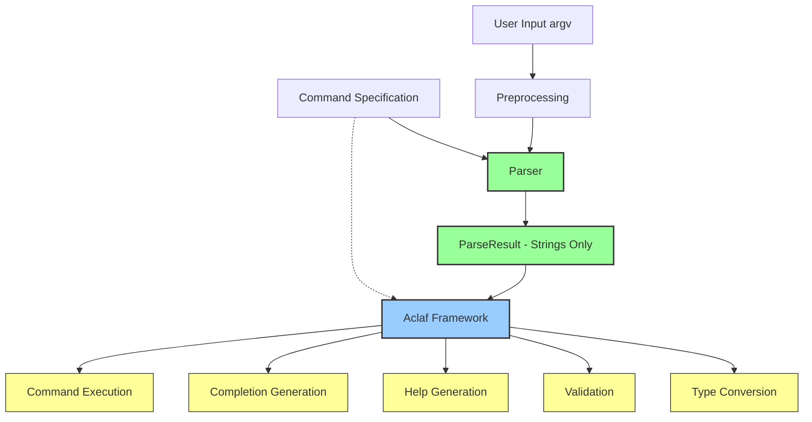

# Architecture

--8<-- "unreleased.md"

## Table of contents

- [Architecture](#architecture)
  - [Table of contents](#table-of-contents)
  - [Introduction](#introduction)
    - [What is Flagrant?](#what-is-flagrant)
    - [Core purpose and scope](#core-purpose-and-scope)
    - [Position as parsing engine vs full framework](#position-as-parsing-engine-vs-full-framework)
    - [Target audience for this document](#target-audience-for-this-document)
  - [Architecture at a glance](#architecture-at-a-glance)
  - [Design philosophy](#design-philosophy)
    - [Specification-driven approach](#specification-driven-approach)
    - [Separation of concerns (syntax vs semantics)](#separation-of-concerns-syntax-vs-semantics)
    - [Immutability throughout](#immutability-throughout)
    - [Data-oriented architecture](#data-oriented-architecture)
    - [Zero runtime dependencies (except typing-extensions)](#zero-runtime-dependencies-except-typing-extensions)
    - [Type safety and static analysis](#type-safety-and-static-analysis)
  - [Architectural principles](#architectural-principles)
    - [Parser architecture](#parser-architecture)
    - [Immutable specifications](#immutable-specifications)
    - [Single-pass parsing](#single-pass-parsing)
    - [Fail-fast validation](#fail-fast-validation)
    - [Layered architecture](#layered-architecture)
  - [Module organization](#module-organization)
    - [Root-level modules](#root-level-modules)
    - [Parser subsystem (`flagrant.parser`)](#parser-subsystem-flagrantparser)
    - [Specification subsystem (`flagrant.specification`)](#specification-subsystem-flagrantspecification)
  - [Specification model](#specification-model)
    - [Command specification hierarchy](#command-specification-hierarchy)
    - [Option specifications (Flag, Value, Dict)](#option-specifications-flag-value-dict)
    - [Positional specifications](#positional-specifications)
    - [Arity concept](#arity-concept)
    - [Accumulation modes](#accumulation-modes)
      - [Accumulation overview](#accumulation-overview)
      - [Accumulation modes and value shapes](#accumulation-modes-and-value-shapes)
    - [Why immutable dataclasses](#why-immutable-dataclasses)
  - [Parser subsystem](#parser-subsystem)
    - [Single-pass algorithm](#single-pass-algorithm)
      - [Dictionary options overview](#dictionary-options-overview)
    - [Argument file preprocessing](#argument-file-preprocessing)
    - [Configuration](#configuration)
    - [Parse results](#parse-results)
  - [Data flow](#data-flow)
    - [Parsing flow](#parsing-flow)
  - [Configuration system](#configuration-system)
    - [Three-tier configuration](#three-tier-configuration)
    - [Override precedence](#override-precedence)
    - [Why this design](#why-this-design)
  - [Error handling](#error-handling)
    - [Construction-time errors](#construction-time-errors)
    - [Parse-time errors](#parse-time-errors)
    - [Error context](#error-context)
  - [Extension points](#extension-points)
  - [Performance characteristics](#performance-characteristics)
    - [Parser](#parser)
  - [Type safety](#type-safety)
    - [Comprehensive type hints](#comprehensive-type-hints)
    - [Static analysis benefits](#static-analysis-benefits)
  - [Dependencies](#dependencies)
    - [Runtime](#runtime)
    - [Development](#development)
  - [Testing strategy](#testing-strategy)
    - [Why minimal dependencies](#why-minimal-dependencies)
  - [Relationship to Aclaf](#relationship-to-aclaf)
    - [What Flagrant provides](#what-flagrant-provides)
    - [What Aclaf provides](#what-aclaf-provides)
    - [Why separated](#why-separated)
  - [Glossary](#glossary)
  - [See also](#see-also)

---

## Introduction

Flagrant is a specification-driven command-line parser designed as a foundation for building CLI programs in Python 3.10+. This document explains Flagrant architecture, design decisions, and internal organization.

### What is Flagrant?

Flagrant is a low-level parsing engine that transforms command-line arguments into structured data. It accepts a declarative specification of your CLI's structure and produces parsed results as pure data structures containing string values. Flagrant does NOT perform type conversion, validation, command execution, help generation, or shell completion generation—these are responsibilities of higher-level frameworks like Aclaf.

### Core purpose and scope

Flagrant responsibilities are strictly limited to:

- **Syntactic parsing**: Classifying tokens as options, positionals, or subcommands
- **Value extraction**: Consuming the correct number of values based on arity
- **Error identification**: Detecting syntactic problems and providing rich context

Flagrant explicitly does NOT handle:

- **Semantic interpretation**: Understanding what values mean
- **Type conversion**: Converting strings to integers, dates, paths, etc.
- **Validation**: Checking if values satisfy business rules
- **Help generation**: Producing usage messages or documentation
- **Completion generation**: Producing shell-specific completion scripts
- **Command execution**: Invoking handlers or callbacks
- **Error presentation**: Rendering error messages for users

### Position as parsing engine vs full framework

Flagrant occupies the lowest layer of a CLI stack. It's analogous to a lexer and parser in a compiler, handling syntax but not semantics. The separation allows Flagrant to remain focused, testable, and reusable while enabling frameworks like [Aclaf](https://aclaf.sh) to layer rich semantics on top.

This architectural decision makes Flagrant suitable for:

- Embedding in CLI frameworks
- Custom CLI tools with specific semantic requirements
- Prototyping new CLI patterns without semantic constraints
- Testing parsing behavior independently of application logic

### Target audience for this document

This document is written for:

- Developers extending or modifying Flagrant
- Framework authors building on top of Flagrant
- Contributors reviewing code changes
- Architects evaluating Flagrant for their projects

Basic familiarity with command-line interfaces, Python dataclasses, and type hints is assumed.

## Architecture at a glance

Flagrant architecture focuses on syntactic parsing, with Aclaf handling semantic interpretation and presentation:



**Key flows:**

- **Parsing:** argv → Preprocessing (argument files) → Parser → ParseResult (strings only)
- **Aclaf consumes:** ParseResult + Specification → Type conversion, validation, help, completions, execution
- **Boundaries:** Flagrant stops at structured strings; Aclaf handles all semantics and presentation

## Design philosophy

Flagrant architecture emerges from a set of core design principles that guide every implementation decision.

### Specification-driven approach

The entire CLI structure is declared upfront as an immutable specification tree. By making specifications explicit data structures rather than implicit in code, Flagrant enables:

- Static analysis of CLI structure before parsing begins
- Serialization of CLI definitions for documentation generation
- Validation of specification correctness at construction time
- Clear separation between CLI structure (specification) and runtime behavior (parser/completer)

This approach contrasts with decorator-based or imperative CLI builders where structure emerges from execution order and can be harder to introspect.

### Separation of concerns (syntax vs semantics)

!!! info "Syntax vs semantics"
    Flagrant draws a sharp boundary between syntax (how arguments look) and semantics (what they mean). The parser answers "Did the user type `--count 5`?" not "Is 5 a valid count?" This separation provides:

    - **Focused codebase**: Flagrant can optimize parsing without semantic complexity
    - **Flexible semantics**: Higher layers can interpret values differently based on context
    - **Independent testing**: Parse correctness can be verified without semantic knowledge
    - **Reusability**: The same parser can support multiple semantic interpretations

    For example, Flagrant parses `--date 2024-01-15` as the string `"2024-01-15"`. A framework like Aclaf then converts this to a `datetime.date` object and validates it's not in the future. Flagrant never needs to know about dates, paths, URLs, or domain-specific types.

### Immutability throughout

!!! tip "Immutability"
    All core data structures—specifications, configurations, and results—are immutable frozen dataclasses with `slots=True`. This pervasive immutability delivers:

    - **Thread safety**: Specifications can be safely shared across threads without locks
    - **Predictability**: Data structures cannot be modified after creation, eliminating temporal coupling
    - **Caching opportunities**: Results can be cached by reference since they never change
    - **Debugging simplicity**: Data snapshots are guaranteed consistent

    The cost is slightly more verbose construction (using `object.__setattr__` in `__init__` for frozen dataclasses), but the benefits far outweigh this minor inconvenience.

### Data-oriented architecture

Flagrant uses pure, immutable data structures rather than complex object graphs with behavior:

**Specifications are data:** Command hierarchies, options, and positionals are represented as frozen dataclasses with no methods beyond construction and access. This enables:

- **Serialization:** Specifications can be saved as JSON/YAML for config-driven CLIs
- **Testing:** Pure data structures are trivial to construct in tests
- **Caching:** Immutable specs can be safely cached and reused
- **Analysis:** Tools can introspect CLI structure without executing code

**Results are data:** Parse and completion results contain only data (strings, tuples, booleans), never behavior. Higher layers interpret meaning and perform actions.

This data-first approach keeps Flagrant focused on its core responsibility: transforming argument strings into structured data.

### Zero runtime dependencies (except typing-extensions)

Flagrant depends only on the Python standard library plus `typing-extensions` for modern typing features. This minimalism is a deliberate architectural constraint that:

- **Reduces supply chain risk**: Fewer dependencies mean fewer security vulnerabilities
- **Improves reliability**: No third-party code can break Flagrant
- **Simplifies maintenance**: No need to track dependency updates
- **Enables broad adoption**: Projects can use Flagrant without concern about dependency conflicts

The `typing-extensions` dependency is justified because it provides modern typing features (like `TypeIs`, `ReadOnly`, `Doc`) to Python 3.10+ that are essential for type safety without requiring Python 3.11+.

### Type safety and static analysis

Flagrant maintains comprehensive type hints on all public and internal code, validated by basedpyright in strict mode. This commitment to type safety:

- **Catches bugs early**: Type errors are detected during development, not at runtime
- **Improves IDE experience**: Autocomplete, go-to-definition, and refactoring work seamlessly
- **Documents contracts**: Type signatures serve as machine-checked documentation
- **Enables refactoring**: Large-scale changes can be made confidently with type checker validation

For example, option values have precise union types (`FlagOptionValue | ValueOptionValue | DictOptionValue`) that prevent mixing incompatible value types and enable exhaustive pattern matching.

## Architectural principles

### Parser architecture

Flagrant parser is designed for correctness, predictability, and performance:

**Strict and deterministic**: Given complete input, the parser either succeeds with a valid `ParseResult` or fails with a detailed error. The parser enforces all rules: unknown options are errors, arity violations are errors, invalid syntax is an error. This strictness helps catch configuration errors early and provides clear feedback when arguments don't match expectations.

**Single-pass processing**: The parser makes exactly one left-to-right pass through the argument vector, classifying each token and consuming values as it goes. The parser uses no backtracking, no lookahead beyond immediate value consumption, and no speculative parsing. This provides O(n) complexity and predictable performance.

**Fail-fast validation**: Specifications and configurations are validated at construction time, not during parsing. If a `CommandSpecification` has problems, this is detected when the specification is created, raising a `SpecificationError`. All parse-time errors represent user input problems, not specification bugs.

### Immutable specifications

Specifications are constructed once and never modified. This immutability enables multiple important optimizations and guarantees:

**Thread safety**: A single `CommandSpecification` can be shared across multiple threads parsing different inputs simultaneously. No locks or synchronization are required because the specification cannot change.

**Caching opportunities**: Because specifications are immutable, a parser or completer instance can cache derived data structures (like option name lookup tables) without worrying about invalidation. These caches can be keyed by specification identity (object ID) rather than expensive deep comparisons.

**Serialization**: Immutable specifications can be reliably serialized to JSON or YAML for documentation generation, introspection tools, or transmission over RPC boundaries. The serialized form is guaranteed to represent the actual specification because nothing can change it.

**Correctness**: Immutability eliminates entire classes of bugs related to unintended mutation, shared mutable state, or temporal coupling. If a specification is valid at construction, it remains valid forever.

The cost is that specifications cannot be incrementally built or modified after creation. Instead, new specifications must be constructed. For most CLI use cases, this is not a limitation—specifications are defined once at application startup.

### Single-pass parsing

Flagrant's parser makes exactly one left-to-right pass through the argument vector, classifying each token and consuming values as it goes. The parser performs no backtracking, no lookahead beyond immediate value consumption, and no speculative parsing.

**Performance characteristics**: Single-pass parsing provides O(n) complexity where n is the number of arguments. Memory usage is proportional to the result size, not the input size, since tokens are classified and consumed immediately. This makes parsing performance highly predictable and suitable for even extremely large argument vectors.

**Memory efficiency**: The parser does not build abstract syntax trees or maintain multiple candidate parse states. Intermediate data structures are minimal—typically just a working dictionary being populated. This keeps memory overhead low and garbage collection pressure minimal.

**Predictable complexity**: Because the parser never backtracks, the worst-case complexity is identical to the best-case complexity. No pathological inputs exist that cause exponential behavior or excessive memory allocation.

The single-pass constraint does impose some limitations. For instance, positional arguments cannot be fully resolved until all options are processed (since options can appear in any order). But these limitations are handled cleanly through deferred grouping rather than multiple passes.

### Fail-fast validation

Flagrant validates specifications and configurations at construction time, not during parsing. If a `CommandSpecification` has duplicate option names or conflicting arity constraints, this is detected when the specification is created, raising a `SpecificationError`. If a `ParserConfiguration` has invalid settings (like a negative `max_argument_file_depth`), this is caught during configuration construction.

**Construction-time vs parse-time errors**: Construction-time errors show problems with the CLI definition itself—developer mistakes that should be fixed in code. Parse-time errors show problems with user input—incorrect usage that should be reported to the user. By failing fast during construction, Flagrant ensures that all parse-time errors represent user mistakes, not specification bugs.

**Clear error boundaries**: The distinction between `SpecificationError` (construction), `ParserConfigurationError` (construction), and `ParseError` (runtime) makes error sources immediately clear. Developers know that a `SpecificationError` means they need to fix their specification, not debug user input.

**No invalid states**: Because specifications are validated at construction and are immutable, the parser can assume it is working with a valid specification. This eliminates defensive checks throughout the parsing code, making it simpler and faster.

### Layered architecture

Flagrant is the bottom layer of a CLI stack:

**What Flagrant handles (syntax)**:

- Token classification: Is this a long option, short option, positional, or subcommand?
- Value extraction: How many values does this option consume?
- Grouping: Which positional values belong to which positional specification?
- Syntax validation: Is the command-line input structurally valid?

**What higher layers handle (semantics)**:

- Type conversion: Converting "42" to the integer 42 or "2024-01-15" to a date object
- Validation: Checking that a port number is in range 1-65535
- Coercion: Expanding "~" to the user's home directory
- Help generation: Producing usage messages from specifications
- Command execution: Invoking functions or methods based on parsed results
- Error presentation: Formatting parse errors for user display

**Clean contracts between layers**: The interface between Flagrant and higher layers is purely data. Flagrant produces a `ParseResult` containing string values and dictionaries. Higher layers consume this result and interpret it. No callbacks, dependency injection, or control inversion exists. This clean separation makes each layer independently testable and allows multiple higher-layer frameworks to build on Flagrant.

## Module organization

Flagrant codebase is organized into three main areas: root-level modules, the parser subsystem, and the specification subsystem.

### Root-level modules

These modules provide shared types and configuration used throughout Flagrant:

**`types.py` - Core type definitions**

Defines fundamental types used throughout Flagrant:

- Type aliases for result values: `FlagOptionValue`, `ValueOptionValue`, `DictOptionValue`, `PositionalValue`, `OptionValue`
- `ParseResultDict`: TypedDict for serialized parse results

These types establish the vocabulary for Flagrant's type system.

**`enums.py` - Enumeration types**

Defines string enums for top-level configuration:

- `ArgumentFileFormat`: LINE vs SHELL parsing modes

Additional enums are defined in subsystem-specific modules.

**`configuration.py` - Parser configuration**

Defines the `ParserConfiguration` dataclass containing all settings that control parsing behavior:

- Option and command matching rules (case sensitivity, abbreviations, underscore conversion)
- Syntactic elements (prefixes, separators, escape characters)
- Feature toggles (argument files, negative numbers)
- Limits (max argument file depth, minimum abbreviation length)

**`defaults.py` - System constants**

Defines default values for configuration options:

- Default separators, prefixes, and escape characters (for example, `DEFAULT_LONG_NAME_PREFIX = "--"`)
- Default patterns (for example, `DEFAULT_NEGATIVE_NUMBER_PATTERN`)

Centralizing defaults ensures consistency and makes changing defaults a single-line modification.

**`exceptions.py` - Error hierarchy**

Defines the base exception hierarchy for Flagrant:

- `FlagrantError`: Base exception for all Flagrant errors

Subsystems define their own specific exceptions (for example, `ParserError`, `SpecificationError`).

### Parser subsystem (`flagrant.parser`)

The parser subsystem transforms argument vectors into structured results.

**Core parser implementation**

Contains the core parsing algorithm:

- Argument file preprocessing (@file expansion with recursion limits)
- Token classification (long option, short option, positional, subcommand, separator)
- Value consumption based on arity (exactly N, at least N, at most N, unbounded)
- Positional grouping and distribution
- Subcommand handling and recursive parsing
- Error context tracking (argv snapshot, argument index, subcommand path)

The parser uses a single-pass algorithm with no backtracking. It maintains minimal state (current option being populated, positional accumulator) and produces a `ParseResult` directly.

**Parse result data structures**

`ParseResult` is the output of parsing:

- `command`: The matched command name
- `args`: The original argument vector
- `options`: Dictionary mapping option names to their values
- `positionals`: Dictionary mapping positional names to their values
- `subcommand`: Nested `ParseResult` for subcommand, if present

`ParseResult` provides rich traversal methods for working with subcommand hierarchies:

- `__iter__`: Iterate through command hierarchy root-to-leaf
- `path`: Full command path as tuple (for example, `("git", "remote", "add")`)
- `leaf`: The deepest subcommand result
- `all_options`/`all_positionals`: Merged options/positionals from entire hierarchy
- `find_option`/`find_positional`: Search from leaf to root

**Parser exceptions**

Parser-specific exceptions include:

- `ParseError` and subclasses: Problems with user input (runtime)
  - Includes rich context: argv snapshot, argument index, subcommand path
  - Enables precise error rendering by higher layers

**Public API**

The public parser API exports:

- `parse_command_line_args()`: High-level parsing function
- `ParseResult`: Parse result dataclass

### Specification subsystem (`flagrant.specification`)

The specification subsystem defines CLI structure through immutable dataclasses.

**Command specifications**

`CommandSpecification` is the root of the specification tree:

- Contains options, positionals, and subcommands
- Forms hierarchical structure for nested commands
- Immutable dataclass with validation

**Option specifications**

The option specification hierarchy includes:

- `FlagOptionSpecification`: Boolean flags (for example, `--verbose`)
- `ValueOptionSpecification`: Options accepting values (for example, `--output file.txt`)
- `DictOptionSpecification`: Options accepting key=value pairs (for example, `--config key=value`)

Each option type includes:

- Long and short names
- Arity constraints
- Accumulation modes
- Negation prefixes (for flags)

**Arity types**

Arity-related types include:

- `Arity`: NamedTuple representing min/max value constraints
- Common arity constants: `EXACTLY_ONE`, `AT_LEAST_ONE`, `ZERO_OR_MORE`, etc.

**`enums.py` - Accumulation modes**

Defines enums for handling repeated parameters:

- `FlagAccumulationMode`: FIRST, LAST, COUNT, ERROR
- `ValueAccumulationMode`: FIRST, LAST, APPEND, EXTEND, ERROR
- `DictAccumulationMode`: MERGE, FIRST, LAST, APPEND, ERROR
- `DictMergeStrategy`: SHALLOW vs DEEP merging

**Specification exceptions**

Specification-specific exceptions include:

- `SpecificationError` and subclasses: Invalid specifications (construction-time)
  - Duplicate option names
  - Invalid arity constraints
  - Conflicting configurations

**Specification validation**

Validation logic for specifications includes:

- Duplicate name detection
- Arity constraint validation
- Configuration consistency checks

**Specification helpers**

Utility functions for working with specifications:

- Specification traversal
- Name resolution
- Lookup tables

**Public API**

The public specification API exports:

- `CommandSpecification`
- Option specifications: `FlagOptionSpecification`, `ValueOptionSpecification`, `DictOptionSpecification`
- Accumulation modes and enums

## Specification model

The specification model defines the structure of a CLI as an immutable tree of dataclasses. This tree is the single source of truth for both parsing and completion.

### Command specification hierarchy

A CLI is represented as a hierarchy of `CommandSpecification` objects. Each command specification contains:

- **Options**: Named parameters like `--verbose` or `-o file`
- **Positionals**: Unnamed parameters identified by position
- **Subcommands**: Nested commands forming a tree (for example, `git remote add`)

The root `CommandSpecification` represents the top-level command. Its `subcommands` tuple contains nested `CommandSpecification` objects, each potentially containing further subcommands, forming an arbitrarily deep tree.

Example structure:

```python
git_spec = CommandSpecification(
    name="git",
    options=(
        FlagOptionSpecification(name="verbose", long_names=frozenset({"verbose"}), short_names=frozenset({"v"})),
    ),
    subcommands=(
        CommandSpecification(
            name="remote",
            subcommands=(
                CommandSpecification(
                    name="add",
                    positionals=(
                        PositionalSpecification(name="name"),
                        PositionalSpecification(name="url"),
                    ),
                ),
            ),
        ),
    ),
)
```

This specification declares a `git` command with a `-v`/`--verbose` flag and a `git remote add <name> <url>` subcommand structure.

### Option specifications (flag, value, dict)

Options are named parameters that can appear in any order. Flagrant supports three kinds:

**Flag options** (`FlagOptionSpecification`) represent boolean flags that take no values:

```python
FlagOptionSpecification(
    name="verbose",
    long_names=frozenset({"verbose", "v"}),  # --verbose or --v
    short_names=frozenset({"v"}),            # -v
    accumulation_mode=FlagAccumulationMode.COUNT,  # Count occurrences
    negation_prefixes=frozenset({"no"}),     # Allows --no-verbose
)
```

Flags are set to `True` when present, `False` when negated, or an integer when counted.

**Value options** (`ValueOptionSpecification`) accept one or more string values:

```python
ValueOptionSpecification(
    name="output",
    long_names=frozenset({"output"}),
    short_names=frozenset({"o"}),
    arity=Arity(1, 1),            # Exactly one value
    accumulation_mode=ValueAccumulationMode.LAST,
    allow_negative_numbers=True,   # Allow -5 as a value
)
```

Values are consumed immediately following the option. Arity controls how many values are consumed.

**Dictionary options** (`DictOptionSpecification`) accept key-value pairs with rich nesting:

```python
DictOptionSpecification(
    name="config",
    long_names=frozenset({"config"}),
    short_names=frozenset({"c"}),
    arity=Arity(1, None),          # One or more key=value pairs
    accumulation_mode=DictAccumulationMode.MERGE,
    allow_nested=True,              # Allow foo.bar.baz=value
    nesting_separator=".",
    key_value_separator="=",
)
```

Dictionary options support complex nested structures, list syntax (`list[0]=a`), and merging strategies.

### Positional specifications

Positionals are unnamed parameters identified by their position in the argument vector:

```python
PositionalSpecification(
    name="files",
    arity=Arity(1, None),  # One or more files
    greedy=False,          # Don't consume all remaining arguments
)
```

Positionals are matched in the order they appear in the specification. The parser groups positional arguments according to arity constraints and distributes them to positional specifications.

### Arity concept

Arity defines how many values a parameter accepts, specified as a `(min, max)` pair:

- `Arity(1, 1)`: Exactly one value (most common for value options)
- `Arity(2, 2)`: Exactly two values (for example, `--range 1 10`)
- `Arity(0, 0)`: No values (flags only)
- `Arity(1, None)`: One or more values (unbounded, for example, variadic positionals)
- `Arity(0, None)`: Zero or more values (optional variadic)
- `Arity(2, 5)`: Between 2 and 5 values (bounded range)

**Shapes and result types**: Arity determines the result structure:

- Exactly 1 (`Arity(1, 1)`): Single string value `"foo"`
- Exactly N where N > 1 (`Arity(2, 2)`): Tuple of strings `("foo", "bar")`
- Unbounded (`Arity(1, None)` or `Arity(0, None)`): Tuple of strings `("foo", "bar", "baz")`

This mapping allows consumers to pattern match on result structure based on known arity.

### Accumulation modes

When an option or positional appears multiple times, accumulation modes control the result:

**Flag accumulation** (`FlagAccumulationMode`):

- `FIRST`: Keep first occurrence, ignore rest → `True` or `False`
- `LAST`: Keep last occurrence, overwrite previous → `True` or `False`
- `COUNT`: Count total occurrences → integer `3`
- `ERROR`: Raise `ParseError` on duplicates

**Value accumulation** (`ValueAccumulationMode`):

- `FIRST`: Keep first occurrence → `"a"` or `("a", "b")`
- `LAST`: Keep last occurrence → `"c"` or `("c", "d")`
- `APPEND`: Tuple of tuples → `(("a", "b"), ("c", "d"))` for arity 2
- `EXTEND`: Flattened tuple → `("a", "b", "c", "d")` for arity 2
- `ERROR`: Raise `ParseError` on duplicates

**Dictionary accumulation** (`DictAccumulationMode`):

- `MERGE`: Merge all occurrences into single dict (strategy configurable)
- `FIRST`: Keep first occurrence → `{"a": "1"}`
- `LAST`: Keep last occurrence → `{"b": "2"}`
- `APPEND`: Tuple of dicts → `({"a": "1"}, {"b": "2"})`
- `ERROR`: Raise `ParseError` on duplicates

Accumulation modes allow fine-grained control over repeated parameters without custom logic.

#### Accumulation overview

When an option or positional appears multiple times in the command line, accumulation modes determine how Flagrant combines those occurrences into the final result:

**Flags** can be counted (`-vvv` → 3), kept as first/last occurrence, or rejected as errors. This enables verbosity levels through repetition without custom parsing.

**Values** can be kept as first/last occurrence, collected into nested tuples (APPEND preserves grouping), flattened into a single tuple (EXTEND), or rejected as errors. The choice depends on whether you need to distinguish separate invocations.

**Dictionaries** can be deeply merged (combining nested structures), kept as first/last occurrence, collected as a tuple of separate dictionaries, or rejected as errors. Deep merging enables incremental configuration building from multiple sources.

The accumulation mode is specified per-option in the specification and controls both the semantics and the resulting value shape.

#### Accumulation modes and value shapes

When an option appears multiple times, its accumulation mode determines the result shape:

**Flags** (FlagAccumulationMode):

- FIRST/LAST: Boolean indicating presence
- COUNT: Integer counting occurrences (`-vvv` → 3)
- ERROR: Reject repeated flags

**Values** (ValueAccumulationMode):

- FIRST/LAST: Single string or tuple (depending on arity)
- APPEND: Preserves grouping as nested tuples `(('a', 'b'), ('c',))`
- EXTEND: Flattens all values into single tuple `('a', 'b', 'c')`
- ERROR: Reject repeated options

**Dictionaries** (DictAccumulationMode):

- MERGE: Combine dictionaries (SHALLOW or DEEP strategy)
- FIRST/LAST: Single dictionary
- APPEND: Tuple of dictionaries
- ERROR: Reject repeated options

This type-specific design ensures result shapes match semantic intent.

### Why immutable dataclasses

Specifications are frozen dataclasses (`frozen=True, slots=True`) for multiple reasons:

**Design rationale**:

- Specifications represent static CLI structure, which shouldn't change during execution
- Immutability prevents accidental modification that could lead to inconsistent parser behavior
- Frozen dataclasses are hashable, enabling use as dictionary keys or in sets
- The `frozen=True` guarantee is enforced by Python's dataclass mechanism at runtime

**Benefits for testing**:

- Specifications can be constructed once and reused across many test cases
- Test isolation is guaranteed—one test cannot modify a specification used by another
- Property-based tests can generate specifications without worrying about mutation
- Specifications can be pickled for parallel testing or fuzzing

**Benefits for caching**:

- Derived data structures (for example, option name lookup tables) can be cached by specification identity
- No cache invalidation needed since specifications never change
- Several parsers can share the same specification safely
- Results can be cached by specification reference

The cost is construction verbosity (custom `__init__` methods using `object.__setattr__`), but this one-time cost at construction is heavily outweighed by benefits throughout the lifetime of the specification.

## Parser subsystem

The parser transforms an argument vector (`argv`) into a structured `ParseResult`. It operates in a single left-to-right pass with no backtracking.

### Single-pass algorithm

The parsing algorithm consists of multiple phases executed in sequence:

**1. Argument file preprocessing (@file expansion)**

Before parsing begins, arguments prefixed with `@` are expanded:

```python
["command", "@args.txt", "foo"]
→ ["command", "arg1", "arg2", "arg3", "foo"]  # if args.txt contains arg1, arg2, arg3
```

Argument files are read and parsed according to `argument_file_format` (LINE or SHELL). The expansion is recursive (with depth limits) and happens before any classification. This preprocessing simplifies the main parsing loop by normalizing input.

**2. Token classification**

Each argument is classified into specific categories:

- **Long option**: Matches `--prefix` pattern (for example, `--output`)
- **Short option cluster**: Matches `-prefix` pattern (for example, `-vxf`)
- **Trailing separator**: The `--` argument (ends option processing)
- **Subcommand**: Matches a subcommand name at appropriate position
- **Positional value**: Everything else

Classification uses configuration-driven rules (prefixes, separators) and the current specification's defined options and subcommands.

**3. Value consumption**

When an option is classified, the parser immediately consumes the required number of values based on arity:

- For `Arity(1, 1)`, consume exactly 1 following argument
- For `Arity(2, 2)`, consume exactly 2 following arguments
- For `Arity(1, None)`, consume all following arguments until next option or separator

Values are stored in the working `options` dictionary under the option's canonical name. Accumulation mode determines how to merge values if the option appears multiple times.

**4. Positional grouping**

Arguments not classified as options or subcommands are accumulated as positional values. After all options are processed, these positional values are distributed to `PositionalSpecification` objects in order, respecting arity constraints:

```python
Positionals defined: [file (arity 1), args (arity 0-None)]
Values: ["main.py", "arg1", "arg2", "arg3"]
Result: file="main.py", args=("arg1", "arg2", "arg3")
```

Grouping happens after option processing to handle interspersed options correctly (unless `strict_posix_options=True`).

**5. Subcommand handling**

When a subcommand is classified, the parser:

1. Identifies which subcommand specification matches
2. Splits the remaining arguments at the subcommand boundary
3. Recursively parses the subcommand with its specification
4. Nests the subcommand's `ParseResult` in the parent's `subcommand` field

This recursive structure naturally handles arbitrary subcommand depth (for example, `git remote add origin url`).

#### Dictionary options overview

!!! success "Dictionary options as a key architectural feature"
    Flagrant provides first-class support for dictionary arguments, a key differentiator from other parsing libraries. Dictionary options enable rich configuration directly on the command line without requiring JSON strings or separate configuration files.

**Syntax:**

```bash
--config server.host=localhost          # Nested keys via dot notation
--config server.port=8000
--config database.pool.size=10          # Deep nesting
--config features[0]=auth               # List indices
--config features[1]=logging
```

**Parsing:**

- Dedicated grammar for key paths, values, escaping
- Supports nested dictionaries and lists
- Configurable separators (`.` for nesting, `=` for key-value)

**Merge strategies:**

- SHALLOW: Top-level keys only
- DEEP: Recursive merging of nested structures

**Result:** Structured dictionary matching the specified shape, enabling rich configuration via command line without JSON strings or multiple flags.

### Argument file preprocessing

Argument files allow storing arguments in external files and referencing them with `@filename`:

**@file expansion**: Arguments like `@config.txt` are replaced with the file's contents:

```python
# config.txt (LINE format)
--verbose
--output
result.json

# Command line
program @config.txt foo

# Expanded to
program --verbose --output result.json foo
```

**Formats (LINE, SHELL)**:

- `LINE` format treats each line as a separate argument (simple, predictable)
- `SHELL` format parses the file using shell-like quoting rules (allows spaces in arguments)

**Recursion control**: Argument files can reference other argument files (`@base.txt` can contain `@common.txt`). The `max_argument_file_depth` configuration limits recursion to prevent infinite loops:

```python
# max_argument_file_depth = 5 (default)
@a.txt → @b.txt → @c.txt → @d.txt → @e.txt → @f.txt  # ERROR: too deep
```

Preprocessing happens once before parsing begins, so the main parser never sees `@` arguments—it only sees the expanded form.

### Configuration

Parser configuration controls numerous aspects of parsing behavior:

**Global vs per-option settings**:

- Global settings apply to all options unless overridden (for example, `allow_negative_numbers`)
- Per-option settings override global defaults (for example, `ValueOptionSpecification.allow_negative_numbers`)

Example:

```python
# Global: negative numbers are values
config = ParserConfiguration(allow_negative_numbers=True)

# Override for specific option: negative numbers are still options
count_option = ValueOptionSpecification(
    name="count",
    allow_negative_numbers=False,  # This option doesn't accept negative numbers
)
```

**Override precedence**:

1. Per-option specification settings (highest priority)
2. Global configuration settings
3. System defaults from `constants.py` (lowest priority)

This three-tier system provides flexibility without complexity—most use cases use defaults, some override globally, and rare cases override per-option.

### Parse results

The parser produces a `ParseResult` containing:

**Structured data (options, positionals, subcommands)**:

```python
# After parsing: git remote add origin url
ParseResult(
    command="git",
    args=("git", "remote", "add", "origin", "url"),
    options={},
    positionals={},
    subcommand=ParseResult(
        command="remote",
        args=("git", "remote", "add", "origin", "url"),
        options={},
        positionals={},
        subcommand=ParseResult(
            command="add",
            args=("git", "remote", "add", "origin", "url"),
            options={},
            positionals={
                "name": "origin",
                "url": "url",
            },
            subcommand=None,
        ),
    ),
)
# All option and positional values are strings or tuples of strings.
# The 'args' field contains the original argument vector for error reporting.
```

**String values (no type conversion)**: All values are strings or tuples of strings stored directly in the dictionaries. The parser does NOT convert `"42"` to `42`, `"true"` to `True`, or `"2024-01-15"` to a date object. Type conversion is the responsibility of higher layers.

**Explicit arity guarantees**: The result structure matches the arity constraints:

- `Arity(1, 1)` → single string `"value"`
- `Arity(2, 2)` → tuple `("val1", "val2")`
- `Arity(1, None)` with 3 values → tuple `("val1", "val2", "val3")`

Consumers can safely assume the result structure matches the specification's arity without additional validation.

## Data flow

Understanding how data flows through Flagrant clarifies its role as a parsing engine:

### Parsing flow


**Step-by-step**:

1. **User Input (argv)**: Raw argument vector from command line: `["git", "remote", "add", "origin", "url"]`

2. **Argument File Preprocessing**: Expand `@file` arguments to their contents

3. **Parser + Specification + Configuration**: Parser initialized with specification and configuration

4. **Token Classification**: Each token classified as option, subcommand, positional, or separator

5. **Value Consumption**: Options consume their values immediately based on arity

6. **Positional Grouping**: Non-option arguments grouped and distributed to positionals

7. **Subcommand Handling**: Subcommands trigger recursive parsing of remaining arguments

8. **ParseResult**: Structured result containing string values

9. **Strings, No Conversion**: Result contains only strings—no integers, booleans, dates, etc.

The `ParseResult` is then consumed by higher-level frameworks (like Aclaf) for semantic interpretation, type conversion, validation, help generation, and command execution.

## Configuration system

Flagrant configuration system uses a three-tier precedence model to balance simplicity and flexibility.

### Three-tier configuration

**1. System defaults (in constants.py)**

The lowest priority tier defines sensible defaults for all configuration options:

```python
DEFAULT_LONG_NAME_PREFIX = "--"
DEFAULT_SHORT_NAME_PREFIX = "-"
DEFAULT_TRAILING_ARGUMENTS_SEPARATOR = "--"
DEFAULT_KEY_VALUE_SEPARATOR = "="
DEFAULT_MINIMUM_ABBREVIATION_LENGTH = 3
```

These defaults cover common CLI conventions and work for most use cases without any configuration.

**2. Global configuration (ParserConfiguration)**

The middle tier allows customizing behavior for an entire CLI:

```python
config = ParserConfiguration(
    allow_abbreviated_options=True,     # Enable --verb for --verbose
    case_sensitive_options=False,       # Allow --Output for --output
    allow_negative_numbers=True,        # Treat -5 as value, not option
)

parser = Parser(specification, config)
```

Global configuration is specified once when creating a parser and applies to all options and commands.

Example:

```python
from flagrant import CommandSpecification, FlagOptionSpecification, ValueOptionSpecification
from flagrant import Parser, ParserConfiguration
from flagrant.types import Arity

spec = CommandSpecification(
    name="app",
    options=(
        FlagOptionSpecification(name="verbose", long_names=frozenset({"verbose"})),
        ValueOptionSpecification(name="count", long_names=frozenset({"count"}), arity=Arity(1, 1)),
    ),
)
parser = Parser(spec, config)
result = parser.parse(["--count", "5"])  # result.options["count"] == "5" (string value)
```

**3. Per-option overrides (in specifications)**

The highest priority tier allows individual options to override global settings:

```python
ValueOptionSpecification(
    name="port",
    long_names=frozenset({"port"}),
    allow_negative_numbers=False,  # This option NEVER accepts negative numbers
)
```

This enables fine-grained control when a specific option needs different behavior than the global default.

### Override precedence

When determining effective configuration for a particular option:

1. **Option-level settings** (highest priority): If the option specification defines a setting, use it
2. **Global configuration settings**: If the global configuration defines a setting, use it
3. **System defaults** (lowest priority): Otherwise, use the default from `constants.py`

Example:

```python
# System default
DEFAULT_MINIMUM_ABBREVIATION_LENGTH = 3  # Lowest priority

# Global config
config = ParserConfiguration(minimum_abbreviation_length=2)  # Middle priority

# Option-level override
option = ValueOptionSpecification(
    name="output",
    # This option has no override, so it uses global config value of 2
)

# Another option with override
option2 = ValueOptionSpecification(
    name="verbose",
    # Hypothetically, if options could override this, it would be highest priority
)
```

### Why this design

**Flexibility without complexity**: Most users never specify configuration and rely on sensible defaults. Power users can set global configuration. Advanced use cases can override specific options. The three-tier system handles all these scenarios without requiring every user to specify every setting.

**Explicit over implicit**: Configuration is always explicit—either in the configuration object, in the specification, or in the documented defaults. No hidden configuration sources or environment variables exist that magically change behavior.

**Clear precedence rules**: The precedence order (option > global > default) matches user intuition: "I configured this option specifically" beats "I configured everything" beats "system default."

This design makes it easy to understand where a configuration value comes from and how to override it if needed.

## Error handling

Flagrant distinguishes between construction-time errors (developer mistakes in specifications or configurations) and runtime errors (user mistakes in arguments).

### Construction-time errors

These errors occur when creating specifications or configurations and indicate problems with the CLI definition itself.

**Invalid specifications**: `SpecificationError` is raised for problems in `CommandSpecification`:

- Duplicate option names (two options with the same long name)
- Invalid arity constraints (min > max, or negative values)
- Conflicting option configurations (for example, greedy option before other options)
- Invalid subcommand structure (duplicate subcommand names)

Example:

```python
# ERROR: Two options with the same long name
CommandSpecification(
    name="app",
    options=(
        FlagOptionSpecification(name="verbose", long_names=frozenset({"verbose"})),
        ValueOptionSpecification(name="verbosity", long_names=frozenset({"verbose"})),  # Duplicate!
    ),
)
# Raises: SpecificationError: Duplicate long option name 'verbose'
```

**Configuration conflicts**: `ParserConfigurationError` is raised for invalid configuration:

- Negative `max_argument_file_depth`
- Empty prefix strings
- Invalid regular expression patterns (for example, for `negative_number_pattern`)
- Conflicting settings (for example, `strict_posix_options=True` with interspersed mode)

**Caught before parsing**: All construction-time errors are raised during object construction, before any parsing begins. This fail-fast approach ensures that if a parser is successfully created, the specification and configuration are valid.

### Parse-time errors

These errors occur during parsing and indicate problems with user-provided arguments.

**Unknown options**: Arguments that look like options but don't match any defined option:

```python
parse(["command", "--unknown-flag"])
# Raises: ParseError: Unknown option '--unknown-flag'
```

**Arity violations**: Wrong number of values for an option or positional:

```python
# Option expects exactly 2 values
parse(["command", "--range", "5"])
# Raises: ParseError: Option '--range' expects 2 values, got 1
```

**Type mismatches**: For dictionary options, invalid key-value syntax:

```python
# Missing '=' separator
parse(["command", "--config", "keyvalue"])
# Raises: ParseError: Invalid dictionary syntax 'keyvalue' (expected key=value)
```

**Rich context for rendering**: Every `ParseError` includes rich context:

- `argv_snapshot`: The complete argument vector being parsed
- `argument_index`: The index of the problematic argument
- `subcommand_path`: The current subcommand path (for example, `["git", "remote", "add"]`)
- `expected`: What the parser expected to see
- `actual`: What the parser actually saw

This context enables higher layers (like Aclaf) to render rich, helpful error messages with highlighting and suggestions without needing to re-parse or re-analyze the input.

### Error context

Flagrant error context is designed to enable higher layers to provide excellent error messages without duplicating parsing logic.

**argv snapshot**: The complete original argument vector, unchanged by preprocessing:

```python
error.argv_snapshot = ["command", "--output", "result.json", "--unknown"]
```

This allows error renderers to show the full command line with the problematic argument highlighted.

**Argument index**: The zero-based index of the problematic argument:

```python
error.argument_index = 3  # Points to "--unknown" in the example above
```

This enables precise highlighting or caret positioning in error messages.

**Subcommand path**: The sequence of subcommands leading to the error:

```python
error.subcommand_path = ["git", "remote", "add"]
```

This allows error messages to include context like "In 'git remote add':" before describing the error.

**Enables precise error messages downstream**: With this context, a framework like Aclaf can render errors like:

```text
Error: Unknown option '--unknown'

  command --output result.json --unknown
                                ^^^^^^^^^ unknown option

Did you mean:
  --unknown-flag
```

All the information needed for this rendering is in the `ParseError` context—no re-parsing required.

## Extension points

Flagrant is intentionally limited in scope and avoids extensibility hooks.

**Focused scope**: The Flagrant parser handles syntactic parsing only. Extension points for semantics (type conversion, validation) would blur the boundary between Flagrant and higher layers, making the system more complex and harder to reason about.

**Clear boundaries**: Flagrant maintains a clean contract: it parses according to a specification and produces string-based results. Higher layers interpret those results. This clarity makes testing, debugging, and maintenance much easier.

**Semantic extension happens in Aclaf**: Higher-level frameworks like Aclaf provide extension points for type conversion, validation, command execution, help generation, and completion generation. This separation of concerns allows each layer to evolve independently without coupling their extension mechanisms.

If Flagrant provided hooks for custom parsers, validators, or converters, it would become a framework rather than a library, losing its focus and simplicity.

## Performance characteristics

Flagrant is designed for predictable, efficient performance without requiring tuning for most use cases.

### Parser

**O(n) single-pass complexity**: The parser makes exactly one left-to-right pass through the argument vector. Each argument is examined once, classified, and either consumed as a value or added to the result. No backtracking or re-parsing occurs, so complexity is strictly O(n) where n is the number of arguments.

**No backtracking**: Once a token is classified and consumed, the parser never revisits it. This eliminates worst-case exponential behavior that can occur in backtracking parsers with ambiguous grammars.

**Minimal allocations**: The parser allocates:

- One `ParseResult` per command level (proportional to subcommand depth, typically 1-3)
- Dictionaries for options and positionals (sized to actual results, not input)
- Tuples for multi-valued options (sized exactly to arity)

No speculative allocations, candidate parse trees, or temporary data structures exist that get discarded. Memory usage is proportional to the result size, not the input size.

**Predictable performance**: Because complexity is O(n) with no backtracking and minimal allocations, performance is highly predictable. No pathological inputs exist that cause performance degradation. An argument vector of 1000 arguments takes proportionally longer than 100 arguments, with no super-linear growth.

Typical performance on modern hardware:

- Small commands (10-50 arguments): <1 ms
- Medium commands (100-500 arguments): <10 ms
- Large commands (1000+ arguments): <100 ms

For extremely large argument vectors, preprocessing (argument file expansion) may dominate parsing time, but this is typically not a concern for interactive CLI usage.

## Type safety

Flagrant maintains comprehensive type hints throughout the codebase, validated by basedpyright in strict mode.

### Comprehensive type hints

**All public APIs**: Every public function, method, and class has complete type annotations:

```python
def parse(
    argv: Sequence[str],
    specification: CommandSpecification,
    configuration: ParserConfiguration | None = None,
) -> ParseResult:
    ...
```

Users get IDE autocomplete, type checking, and inline documentation for all public APIs.

**All internal code**: Internal functions and private modules are also fully typed:

```python
def _classify_token(
    token: str,
    specification: CommandSpecification,
    config: ParserConfiguration,
) -> TokenType:
    ...
```

This enables refactoring internal code with confidence and catches bugs early during development.

### Static analysis benefits

**Catch errors at development time**: Type errors are detected by basedpyright during development, not at runtime:

```python
# Type error caught by basedpyright
parser = Parser(specification, config="invalid")  # ERROR: config expects ParserConfiguration, not str
```

This shift-left approach prevents entire classes of bugs from ever reaching production.

**IDE integration**: Comprehensive type hints enable rich IDE features:

- Autocomplete suggests valid method calls and attributes
- Go-to-definition jumps to type definitions and implementations
- Hover tooltips show function signatures and docstrings
- Refactoring tools (rename, extract, inline) work reliably

These features dramatically improve developer productivity and code quality.

**Refactoring safety**: Large-scale refactorings (renaming types, changing function signatures, reorganizing modules) can be performed with confidence. The type checker verifies that all call sites are updated correctly, catching missed changes that would otherwise become runtime errors.

For example, changing `ParseResult.options` from `dict[str, OptionValue]` to a custom type requires updating all code that accesses `.options`. The type checker ensures every access site is updated, preventing subtle bugs.

## Dependencies

Flagrant dependency strategy reflects its position as a foundation-level component.

### Runtime

**typing-extensions only**: Flagrant has exactly one runtime dependency: `typing-extensions`. This library backports modern typing features from Python 3.11+ to Python 3.10+, enabling Flagrant to use advanced type system features while maintaining broad Python version compatibility.

**Provides modern typing features to Python 3.10+**: Specifically, `typing-extensions` provides:

- `TypeIs`: Improved type narrowing (replacement for `TypeGuard`)
- `ReadOnly`: Immutable TypedDict fields
- `Doc`: Inline type documentation
- Type parameter defaults for cleaner generic definitions
- Other typing enhancements from Python 3.11+

These features improve type safety, code clarity, and static analysis without requiring users to upgrade to Python 3.11+.

### Development

**pytest, hypothesis, atheris for testing**: Development dependencies include:

- `pytest`: Test framework for unit, integration, and property-based tests
- `pytest-cov`: Coverage reporting to maintain >95% coverage
- `hypothesis`: Property-based testing to discover edge cases automatically
- `atheris`: Fuzz testing to explore unexpected inputs
- `pytest-benchmark`: Performance benchmarking for critical paths

**ruff, basedpyright for quality**: Code quality dependencies include:

- `ruff`: Fast linter and formatter enforcing code style and detecting errors
- `basedpyright`: Strict type checker validating type hints
- `codespell`: Spell checker for comments and documentation
- `yamllint`: YAML file linter for configuration files

**Standard library otherwise**: Everything else uses Python's standard library:

- `dataclasses` for immutable data structures
- `typing` for type hints
- `pathlib` for file paths
- `shlex` for shell-like argument parsing (argument file SHELL format)
- `re` for regular expressions (negative number pattern)
- `collections.abc` for abstract types

This reliance on standard library avoids dependency bloat and ensures long-term stability.

## Testing strategy

Flagrant emphasizes rigorous testing at multiple levels:

**Parser testing:**

- **Unit tests:** Exercise individual components (classification, value consumption, grouping)
- **Property-based tests:** Use Hypothesis to discover edge cases automatically
- **Fuzz tests:** Atheris-based fuzzing explores unexpected inputs
- **Determinism tests:** Verify identical inputs always produce identical results
- **Integration tests:** Verify end-to-end parsing of complex command structures

The comprehensive test suite (>95% coverage) ensures parser correctness across Python 3.10-3.14 and all major platforms (Linux, macOS, Windows).

### Why minimal dependencies

**Reduced supply chain risk**: Every dependency is a potential attack vector. Malicious packages, compromised maintainers, or vulnerable transitive dependencies can introduce security risks. By minimizing dependencies, Flagrant reduces its attack surface.

**Lower maintenance burden**: Dependencies require ongoing maintenance—tracking updates, responding to security advisories, handling breaking changes in new versions. Fewer dependencies mean less maintenance work for Flagrant maintainers and users.

**Foundation-level component**: Flagrant is intended to be a low-level component used by higher-level frameworks. If Flagrant depended on many third-party libraries, it would impose those dependencies on all consumers, potentially creating conflicts. A minimal dependency footprint makes Flagrant widely compatible and easy to adopt.

## Relationship to Aclaf

Flagrant is designed as the parsing engine for Aclaf, a full-featured command-line application framework. Understanding the division of responsibilities clarifies Flagrant scope.

### What Flagrant provides

**Syntactic parsing (what did user type?)**

Flagrant answers: "Did the user type `--count 5` or `--count 10`?" It classifies tokens, extracts values, and produces structured data representing the syntactic structure of the input. It does NOT answer "Is 5 a valid count?" or "What should we do with count=5?"

**Specification model**

Flagrant defines the `CommandSpecification` hierarchy that describes CLI structure. This model is the interface between Flagrant (parsing) and Aclaf (semantics, presentation).

**Error identification**

Flagrant detects syntactic errors (unknown options, arity violations, invalid syntax) and provides rich context (argv snapshot, argument index, subcommand path). It does NOT render error messages for users—that's Aclaf's responsibility.

### What Aclaf provides

**Semantic interpretation (what does it mean?)**

Aclaf answers: "The count of 5 means run 5 iterations." It interprets parsed string values in the context of the application's domain and business logic.

**Type conversion**

Aclaf converts strings to appropriate types:

- `"42"` → `int` (42)
- `"true"` → `bool` (True)
- `"2024-01-15"` → `datetime.date` (date(2024, 1, 15))
- `"~/file.txt"` → `pathlib.Path` (expanded path)

**Validation**

Aclaf validates values against business rules:

- Port numbers must be 1-65535
- File paths must exist (for inputs) or be writable (for outputs)
- Dates must not be in the future
- email addresses must match a pattern

**Command execution**

Aclaf maps parsed commands to application functions, invokes them with converted and validated arguments, and handles return values and exceptions.

**Help generation**

Aclaf generates usage messages, help text, and documentation from specifications. It renders option descriptions, examples, and usage patterns for users.

**Completion generation**

Aclaf generates shell-specific completion scripts (Bash, Zsh, Fish, PowerShell) from specifications and parse results. It provides context-aware completion suggestions based on the CLI structure.

**Error presentation**

Aclaf renders parse errors and validation errors as user-friendly messages with color, highlighting, suggestions, and examples. It uses the context provided by Flagrant exceptions to produce precise, helpful output.

### Why separated

**Clear responsibilities**: Flagrant handles syntax; Aclaf handles semantics. This separation makes both codebases simpler, more focused, and easier to test. There's no ambiguity about which layer is responsible for a given feature.

**Independent testing**: Flagrant can be tested exhaustively with property-based tests and fuzz tests that generate arbitrary inputs and specifications, without needing domain knowledge or mock application logic. Aclaf can be tested with semantic tests that assume parsing is correct.

**Reusability**: Flagrant can be used by frameworks other than Aclaf or by custom CLI tools with domain-specific requirements. Its minimal dependencies and narrow scope make it broadly reusable.

**Architectural flexibility**: The separation allows Aclaf to change its semantic interpretation, validation strategies, or execution model without affecting Flagrant. Similarly, Flagrant can optimize parsing or add completion features without breaking Aclaf. Each layer can evolve independently as long as the interface (`CommandSpecification` and `ParseResult`) remains stable.

This architecture mirrors compiler design: Flagrant is the lexer/parser (syntax), Aclaf is the semantic analyzer and code generator (semantics). This proven pattern ensures clarity, testability, and maintainability.

## Glossary

**Specification:** Immutable data structure defining CLI structure (commands, options, positionals)

**Arity:** Min/max value count constraint for options and positionals

**Accumulation mode:** Strategy for handling repeated options (FIRST, LAST, APPEND, EXTEND, COUNT, MERGE, ERROR)

**Negation:** Automatic generation of inverse flag forms (for example, `--no-verbose` from `--verbose`)

**Parse result:** Structured output containing options, positionals, and subcommands as strings

**Trailing arguments:** Arguments after `--` separator, not parsed as options

**Argument files:** Files containing arguments, expanded via `@filename` syntax

**Configuration precedence:** Three-tier system: option-level → global configuration → system defaults

**Token classification:** Process of identifying whether an argument is an option, positional, subcommand, or separator

---

## See also

For deeper dives into specific architectural areas:

- **[Concepts](concepts.md)**: Detailed explanations of core concepts (arity, accumulation, negation, etc.) with extensive examples
- **[Parser behavior](behavior.md)**: In-depth exploration of parsing algorithms, preprocessing, and result structures

These documents expand on the architectural overview provided here with implementation details, edge cases, and practical guidance.
