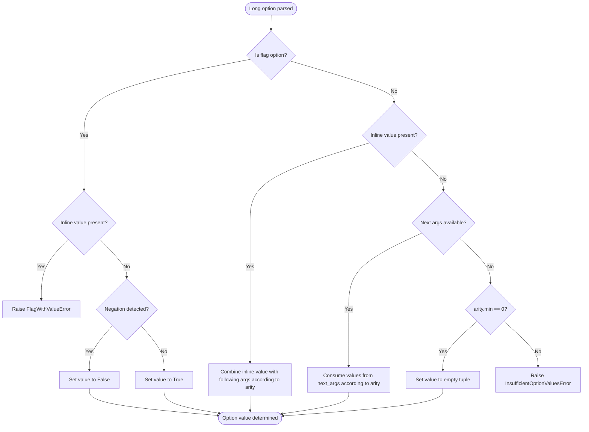

# Parser behavior and runtime characteristics

--8<-- "unreleased.md"

This page specifies the core parsing algorithms and runtime behavior of the Flagrant parser. It details how raw argument strings are transformed into structured parse results through a single-pass, left-to-right parsing process. The document covers argument classification, option parsing (long and short), value consumption, option accumulation, positional grouping, and subcommand resolution.

## Table of contents

- [Overview](#overview)
- [Parsing phases](#parsing-phases)
  - [Phase 1: Initialization](#phase-1-initialization)
  - [Phase 2: Argument classification and processing](#phase-2-argument-classification-and-processing)
  - [Phase 3: Positional grouping](#phase-3-positional-grouping)
  - [Phase 4: Result construction](#phase-4-result-construction)
- [Argument classification algorithm](#argument-classification-algorithm)
- [Long option parsing](#long-option-parsing)
- [Short option parsing](#short-option-parsing)
- [Value consumption](#value-consumption)
  - [Arity semantics](#arity-semantics)
  - [Greedy vs unbounded consumption](#greedy-vs-unbounded-consumption)
  - [Stopping conditions](#stopping-conditions)
  - [Item separator splitting](#item-separator-splitting)
  - [Result shape rules](#result-shape-rules)
- [Option accumulation](#option-accumulation)
  - [List accumulation modes](#list-accumulation-modes)
- [Positional grouping algorithm](#positional-grouping-algorithm)
- [Option resolution](#option-resolution)
- [Subcommand resolution](#subcommand-resolution)
- [Complete parsing example](#complete-parsing-example)
- [Performance characteristics](#performance-characteristics)

---

## Overview

The Flagrant parser transforms raw command-line argument strings into structured parse results through a single-pass, left-to-right algorithm. The parser does not backtrack or make speculative decisions; each argument is classified and processed immediately based on current state and the command specification.

The parsing process consists of four distinct phases:

1. **Initialization** - Validate specifications and prepare resolution caches
2. **Argument classification loop** - Process each argument, classifying and consuming values
3. **Positional grouping** - Distribute collected positional arguments to positional specs
4. **Result construction** - Assemble the final immutable `ParseResult`

This phased approach enables the parser to collect positional arguments during parsing (without knowing how many total positionals there are) and then make optimal allocation decisions in a separate phase once the full count is known. This greedy allocation strategy respects later positionals' minimum requirements while allowing earlier unbounded positionals to consume as much as possible.

## Parsing phases

### Phase 1: Initialization

Initialization occurs once when a parser instance is created, before any parsing operations.

**Specification validation:** the parser validates that the provided `CommandSpecification` is structurally valid:

- All option names (both long and short forms) are unique within the command
- All subcommand names and aliases are unique within the command
- All positional names are unique within the command
- Arity constraints are valid (min >= 0, max >= 0 or None, min <= max)
- Option names follow format rules (long names minimum 2 characters, short names exactly 1)

Invalid specifications raise errors during parser construction, establishing a fail-fast validation boundary. Once a parser is created successfully, the specification is guaranteed to be valid.

**Resolution function caching:** the parser caches option and subcommand resolution results for performance. Resolution lookups are memoized to enable O(1) retrieval for repeated resolutions. A common case like `-vvv` (resolving 'v' three times) benefits from caching, with the first resolution performing the lookup and later resolutions retrieving the cached result.

**Immutability establishment:** the parser itself is immutable after construction. All configuration flags, the specification, and any resolution caches are fixed at this point. This enables safe concurrent reuse of parser instances across threads without synchronization.

!!! warning "Not yet implemented"
    Argument file expansion is planned but not yet implemented in the current parser. The `@file` syntax and behavior described below represent the intended design. For now, `@` characters in arguments are treated as regular text without special processing.

**Preprocessing - Argument file expansion:** if argument files are enabled (`argument_file_prefix` is not None), the parser expands `@file` references before the main parsing loop begins. This preprocessing phase transforms the raw argument list by:

1. Scanning arguments left-to-right for the configured prefix (default `@`)
2. Reading referenced files and parsing their contents according to `argument_file_format` (LINE or SHELL)
3. Splicing the file's arguments inline at the position of the `@file` reference
4. Handling comments (lines starting with `argument_file_comment_char`, default `#`)
5. Respecting the recursion depth limit (`max_argument_file_depth`, default 1)
6. Escaping literal prefix characters via double-prefix (`@@file` → `@file`)

The expansion process maintains left-to-right order, which directly affects precedence: arguments from earlier files appear earlier in the expanded list, and later arguments override earlier ones according to last-wins semantics. The main parsing loop operates on the fully expanded argument list with all `@file` references resolved.

Argument file expansion can fail with several error types (see [error types specification](errors.md)):

- `ArgumentFileNotFoundError` - Referenced file does not exist
- `ArgumentFileReadError` - File exists but cannot be read (permissions, I/O errors)
- `ArgumentFileFormatError` - File contains malformed content (invalid encoding, format violations)
- `ArgumentFileRecursionError` - Recursion depth exceeded or circular reference detected

For complete details on argument file syntax, format options, and processing semantics, see the [argument files specification](argument-files.md).

### Phase 2: Argument classification and processing

The main parsing loop processes arguments left-to-right in a single pass. The parser maintains local state variables during the parse operation:

- **position** - Current index in the argument list
- **options** - Dictionary of parsed options (canonical name → ParsedOption)
- **positionals** - Tuple of collected positional argument strings
- **positionals_started** - Boolean flag indicating whether the parser has encountered any positional argument
- **trailing_mode** - Boolean flag indicating whether the parser is in trailing mode (after `--`)
- **trailing_args** - List of arguments that appeared after `--`

**Loop structure:** the parser processes arguments in order, examining each argument and deciding whether it's an option, positional, subcommand, or trailing argument. For each argument, the parser:

1. Classifies the argument based on its syntactic form and current state
2. Processes the argument according to its classification (consuming values if necessary)
3. Accumulates the result according to the option's accumulation mode
4. Advances the position counter by the number of arguments consumed

The loop continues until all arguments are exhausted or a subcommand transition occurs.

**Subcommand handling:** when the parser encounters a subcommand name, it immediately completes the current command's parse result with all accumulated options and positionals. The remaining arguments are then delegated to recursive parsing using the subcommand's specification. This creates a nested parse result structure that mirrors the command hierarchy.

### Phase 3: Positional grouping

After the argument classification loop completes, the parser groups collected positional arguments according to positional specifications. The grouping algorithm distributes arguments left-to-right while respecting arity constraints and reserving values for later positionals.

See [Positional grouping algorithm](#positional-grouping-algorithm) for the detailed algorithm description with worked examples.

### Phase 4: Result construction

The parser assembles the final immutable `ParseResult` containing:

- The canonical command name (or invoked alias)
- The options dictionary (keyed by canonical option names)
- The positionals dictionary (keyed by positional spec names)
- Any trailing arguments that appeared after `--`
- A reference to the subcommand parse result (if a subcommand was invoked)

The result is immutable after construction, enabling safe sharing and aggressive caching.

## Argument classification algorithm

The parser classifies each argument into one of several syntactic categories. Classification is deterministic given a parser configuration and uses precedence rules to resolve cases where an argument could match multiple patterns.

### Classification precedence

Arguments are classified in the following precedence order:

1. **Trailing mode arguments** - After `--` delimiter, all arguments are trailing
2. **Double-dash separator** - The standalone `--` argument enables trailing mode
3. **Long options** - Arguments starting with `--` (unless POSIX-style ordering conditions apply)
4. **Short options** - Arguments starting with `-` but not `--` or exactly `-` (unless POSIX-style ordering conditions apply)
5. **Subcommands** - Arguments matching defined subcommand names
6. **Positionals** - All other arguments

**Special cases:**

- **Single dash** (`-`) is always treated as a positional argument, following Unix convention for stdin/stdout
- **Negative numbers** are treated as positionals when `allow_negative_numbers=True` and positional specs are defined
- **POSIX-style ordering boundary** - Once the first positional is encountered when `strict_posix_options=True`, all subsequent arguments become positionals

### Formal classification algorithm

The parser classifies each argument according to the following algorithm:

1. **Check trailing mode:**
   - If `trailing_mode` is enabled:
     - Add argument to `trailing_args`
     - Increment position
     - Continue to next argument

2. **Check for double-dash separator:**
   - If argument equals `"--"`:
     - Enable `trailing_mode`
     - Increment position
     - Continue to next argument

3. **Check for long option prefix:**
   - If argument starts with `"--"`:
     - If `strict_posix_options` AND `positionals_started`:
       - Treat as positional argument
     - Otherwise:
       - Parse as long option
     - Continue to next argument

4. **Check for short option prefix:**
   - If argument starts with `"-"` AND argument is not exactly `"-"`:
     - If matches `negative_number_pattern` AND `allow_negative_numbers` AND positionals are defined:
       - Treat as positional argument
     - Else if `strict_posix_options` AND `positionals_started`:
       - Treat as positional argument
     - Otherwise:
       - Parse as short option cluster
     - Continue to next argument

5. **Check for subcommand name:**
   - If argument matches a defined subcommand name:
     - Parse subcommand recursively with remaining arguments
     - Return subcommand result (terminates current command parsing)

6. **Check for single dash:**
   - If argument is exactly `"-"`:
     - Treat as positional argument
     - Continue to next argument

7. **Default classification:**
   - Treat as positional argument
   - Continue to next argument

### POSIX-style ordering enforcement

When `strict_posix_options=True`, the parser enforces POSIX-style ordering where all options must precede all positional arguments. Once the `positionals_started` flag is set (by encountering the first argument that is not an option), all subsequent option-like arguments are reclassified as positionals.

This provides users with the guarantee that option-like values can be passed as positional arguments without ambiguity when POSIX-style ordering is enabled, as long as they appear after at least one positional argument.

### Negative number handling

When `allow_negative_numbers=True` and the command defines positional parameters, arguments matching the negative number pattern are classified as positionals rather than short option clusters.

The negative number pattern (implementation-specific, but typically) matches strings like `-5`, `-3.14`, or `-1e5`. This allows passing negative values as positional arguments while still supporting short options like `-v` for verbosity.

## Long option parsing

Long option parsing handles arguments starting with `--`. The parser supports both equals syntax (`--option=value`) and space syntax (`--option value`) for value assignment.

### Processing steps

Long option parsing follows these steps:

1. **Extract option name and inline value** - Split the argument on `=` if present
2. **Resolve option name** - Match the provided name against defined option specs
3. **Determine value source** - Identify whether values come from inline (equals syntax), following arguments, or neither
4. **Validate and parse values** - Consume values according to arity constraints
5. **Accumulate option** - Combine with existing values using the accumulation mode

### Name parsing

The option name is extracted by removing the `--` prefix. For inline value syntax, the argument is split on the first `=` character. The left side becomes the option name, the right side becomes the inline value.

```
--option          → option name: "option", inline value: None
--option=value    → option name: "option", inline value: "value"
--option=a=b=c    → option name: "option", inline value: "a=b=c"
```

### Negation handling

Before resolving the option name, the parser checks whether the option name starts with a configured negation word. For example, with negation word "no," the option name "no-verbose" is recognized as a negation of the "verbose" option.

The negation check:

1. Iterates through configured negation words
2. Checks if the option name starts with the negation word followed by a dash
3. If found, strips the negation prefix and marks the option as negated
4. Proceeds with name resolution on the base option name

### Long option value handling algorithm

The parser determines how to handle a long option based on its specification type and whether an inline value is present:



**Key decision points:**

1. **Flag vs non-flag:** Flags cannot accept values; attempting to provide one raises an error
2. **Inline value with multi-value arity:** Inline values can be combined with following arguments to satisfy arity constraints; an error is raised only if total values (inline + following) are less than minimum arity
3. **Zero-arity options:** Options with `arity.min == 0` can complete without values
4. **Value consumption:** Non-flag options consume values from following arguments when no inline value is present, or combine inline values with following arguments when inline values are provided

### Inline value semantics

When an equals sign is present in a long option, the value assignment is explicit:

- The inline value provides exactly one value
- For flag options, equals syntax raises an error (flags do not accept values)
- For non-flag options, inline values can be combined with following arguments to satisfy arity constraints
- For non-flag options with arity `(1, 1)`, the inline value alone satisfies the requirement
- For non-flag options with arity `(2, 3)`, an inline value plus following arguments can satisfy the requirement

Examples with an option having arity `(2, 3)`:

```bash
# Option with arity (2, 3) - requires 2-3 values
program --coords=10 20          # OK: inline value '10' + following arg '20' = 2 values
program --coords=10 20 30       # OK: inline value '10' + following args '20' '30' = 3 values
program --coords=10             # ERROR: only 1 value total, needs minimum 2
```

Note that `--files=a b c` provides a single value `"a b c"`, not three separate values. To provide multiple distinct values, the inline value counts as one and additional values come from following arguments.

### Inline values without equals

When `allow_inline_values_without_equals=True`, the parser supports attaching values directly to long option names without an equals sign.

**Parsing algorithm:**

The parser attempts to match the argument against defined option names using prefix matching:

1. First, split on equals sign if present (standard equals syntax takes precedence)
2. If no equals sign and standard name resolution fails, iterate through defined long option names
3. For each long option name, check if the argument (minus prefix) starts with that name
4. If a match is found, extract the option name and treat the remainder as the inline value
5. Use the first matching option found (iteration order determines precedence)

**Precedence rules:**

1. Equals-separated values take precedence: `--output=file.txt` always splits on `=`
2. Exact option name matches take precedence: `--output` matches exactly before prefix matching
3. If no exact match and `allow_inline_values_without_equals=True`, attempt prefix matching
4. First match wins when multiple options could match as prefixes

**Examples:**

```bash
# With allow_inline_values_without_equals=True and options: output, verbose
--outputfile.txt       # Matches "output", inline_value="file.txt"
--verbosemode          # Matches "verbose", inline_value="mode"
--output=file.txt      # Equals syntax takes precedence, inline_value="file.txt"

# With options: output, output-dir (order matters)
--outputfile.txt       # Matches first option "output", inline_value="file.txt"
--output-dirname       # Matches "output-dir", inline_value="name"
```

**Implementation details:**

Prefix matching occurs after standard name resolution fails. The parser iterates through available long option names and uses the first matching prefix. This means option definition order affects which option matches when one option name is a prefix of another.

## Short option parsing

Short option parsing handles arguments starting with `-` (but not `--`). The parser uses a two-phase approach: extracting option specifications, then processing each specification to determine its value.

### Phase 1: Extract option specifications

The parser iterates through characters in the short option argument, identifying which options are present and whether an inline value follows.

```
Input: "-abc"
Characters: a, b, c
Extracted: option_specs = {a, b, c}, inline_value = None

Input: "-a=value"
Characters: a
Stop at: =
Extracted: option_specs = {a}, inline_value = "value"

Input: "-abc123" (with allow_inline_values_without_equals=True and 1,2,3 not defined)
Characters: a, b, c
Stop at: 1 (not a defined short option)
Extracted: option_specs = {a, b, c}, inline_value = "123"

Input: "-ofile.txt" (with allow_inline_values_without_equals=True and 'f' not defined)
Characters: o
Stop at: f (not a defined short option)
Extracted: option_specs = {o}, inline_value = "file.txt"
```

**Extraction rules:**

- Characters are extracted left-to-right
- Extraction stops at `=` (everything after becomes the inline value)
- With `allow_inline_values_without_equals=True`, extraction stops at an unrecognized character (everything from that point becomes the inline value)
- If the first character is unrecognized, an error is raised
- If all characters are recognized, there is no inline value (unless `=` was present)

**Behavior with `allow_inline_values_without_equals`:**

When `allow_inline_values_without_equals=True`:

- Unrecognized characters after valid options mark the start of an inline value
- The inline value includes the unrecognized character and all following characters
- This enables syntax like `-ofilename.txt` even when `f`, `i`, `l`, etc. are not defined options

When `allow_inline_values_without_equals=False` (default):

- Unrecognized characters raise `UnknownOptionError`
- Standard attached value syntax still works for recognized options: `-ofile.txt` works if only the first character needs to be a recognized option

### Phase 2: Process option specifications

The parser treats all options except the last as "inner" options that must be flags. The last option can consume values.

**Processing algorithm:**

1. **For each extracted option specification:**

   - **If last option in cluster:**
     - Apply same value handling logic as long options
     - If inline value present:
       - Use inline value
     - Otherwise:
       - Consume values from following arguments according to arity constraints
     - Accumulate option with determined value

   - **If inner option (not last):**
     - Check if option can be used without values:
       - If option is a flag (`is_flag=True`):
         - Set value to `True`
       - Else if option has zero arity (`arity == (0, 0)`):
         - Set value to `True`
       - Otherwise:
         - Raise `InsufficientOptionValuesError` (inner options cannot consume values)
     - Accumulate option with value `True`

**Inner option constraints:**

Inner options (all except the last) must satisfy one of these conditions:

- Be a flag (is_flag=True) - Set to True
- Have zero arity (0, 0) - Set to True
- Any other option type raises an error

This constraint exists because inner options cannot consume values; there's no way to provide values to them within the clustered syntax.

### Clustering interaction with accumulation

When multiple short option characters are the same option (for example, `-vvv` where 'v' is the verbose flag), each occurrence is processed separately through the accumulation algorithm.

For COUNT accumulation mode, each 'v' increments the counter:

```
-vvv with COUNT mode:
  First 'v':  parsed_option = {name: "verbose", value: True}
              accumulated with COUNT → value = 1

  Second 'v': new_option = {name: "verbose", value: True}
              accumulated with COUNT → value = 1 + 1 = 2

  Third 'v':  new_option = {name: "verbose", value: True}
              accumulated with COUNT → value = 2 + 1 = 3
```

## Value consumption

Value consumption handles consuming multiple values from following arguments when an option doesn't have an inline value. Dictionary options use specialized value consumption with additional parsing steps—see [Dictionary option value consumption](#dictionary-option-value-consumption) below for details.

### Arity semantics

Arity defines the number of arguments an option can accept. The `Arity` type supports several forms:

| Arity form | Minimum | Maximum | Behavior |
|------------|---------|---------|----------|
| `int` (e.g., `3`) | n | n | Fixed count: exactly n values required |
| `"?"` | 0 | 1 | Optional scalar: zero or one value |
| `"*"` | 0 | unbounded | Unbounded: zero or more, stops at options/subcommands |
| `"..."` | 0 | unbounded | Greedy: zero or more, consumes ALL remaining arguments |
| `(min, max)` | min | max | Range: between min and max values |
| `(min, "*")` | min | unbounded | Unbounded range: at least min, stops at options/subcommands |
| `(min, "...")` | min | unbounded | Greedy range: at least min, consumes ALL remaining |

**Helper functions** for working with arity:

- `get_arity_min(arity)` - returns the minimum number of arguments
- `get_arity_max(arity)` - returns the maximum, or `None` if unbounded
- `is_greedy_arity(arity)` - true if arity consumes all remaining arguments
- `is_unbounded_arity(arity)` - true if arity has unbounded max but stops at options
- `is_optional_arity(arity)` - true if arity accepts zero values
- `is_scalar_arity(arity)` - true if arity is `int` or `"?"`

### Greedy vs unbounded consumption

The parser distinguishes between two kinds of multi-value consumption:

**Unbounded** (`"*"` or `(n, "*")`): Consumes values until a stopping condition is met. The parser checks each argument and stops when it encounters a recognized option or subcommand.

```bash
# With arity="*" and --verbose defined
program --files a.txt b.txt --verbose c.txt
# Result: files = ("a.txt", "b.txt")
# --verbose is recognized and stops consumption
```

**Greedy** (`"..."` or `(n, "...")`): Consumes ALL remaining arguments regardless of whether they look like options or subcommands. Use greedy arity when the option should capture everything that follows.

```bash
# With arity="..." and --verbose defined
program --args a.txt --verbose b.txt
# Result: args = ("a.txt", "--verbose", "b.txt")
# --verbose is consumed as a value, not parsed as an option
```

Greedy consumption is useful for passing arguments to subprocess commands or capturing arbitrary strings that may contain option-like patterns.

### Stopping conditions

For non-greedy arities, value consumption stops when any of these conditions occur:

1. **Maximum arity reached** - `consumed >= arity.max` (if max is not None)
2. **Resolvable option detected** - Next argument resolves to a known option name
3. **Subcommand detected** - Next argument matches a defined subcommand name
4. **End-of-options delimiter** - The `--` delimiter is encountered
5. **End of arguments** - No more arguments available

For greedy arities (`"..."` or `(n, "...")`), only conditions 1, 4, and 5 apply. The parser consumes through recognized options and subcommands without stopping.

When `allow_negative_numbers` is enabled, arguments matching the negative number pattern are consumed as values rather than being treated as options, even if they start with `-`.

### Value consumption algorithm

The value consumption algorithm collects argument values from the remaining argument stream:

1. **Initialize collection:**
   - Create empty values list
   - If inline value present, add it to values list
   - Calculate maximum args to consume (accounting for inline value)

2. **Collect values while available:**
   - For each argument in remaining args up to maximum:
     - **If greedy arity:**
       - Consume argument unconditionally
     - **Else (unbounded or bounded):**
       - If argument resolves to known option or subcommand:
         - Stop consumption
       - Otherwise:
         - Consume argument

3. **Validate minimum arity:**
   - If length of values list is less than minimum arity:
     - Raise `OptionMissingValueError`

4. **Apply item separator if enabled:**
   - If `allow_item_separator=True` and `item_separator` is set:
     - Split each value on the separator
     - Respect escape character for literal separators

5. **Normalize result shape:**
   - Apply result shape rules (see below)

### Item separator splitting

List options can split individual argument strings into multiple values using a configurable separator:

```bash
# With allow_item_separator=True and item_separator=","
program --tags red,green,blue
# Result: tags = ("red", "green", "blue")
```

The splitting respects an optional escape character:

```bash
# With escape_character="\\"
program --values 'a\,b,c'
# Result: values = ("a,b", "c")
# The backslash escapes the comma
```

The escape character can also escape itself:

```bash
program --values 'a\\,b'
# Result: values = ("a\\", "b")
# Double backslash produces literal backslash
```

Item separator splitting is disabled by default. To enable it, set both `allow_item_separator=True` and provide an `item_separator` character. Splitting is applied after all arguments are collected, affecting both command-line arguments and inline values.

### Negative number handling

When `allow_negative_numbers` is enabled, the parser recognizes arguments matching the negative number pattern and treats them as values rather than as options. This allows passing negative numbers as option values while still supporting short options.

The negative number pattern (configurable via `negative_number_pattern`) typically matches strings like `-5`, `-3.14`, or `-1e5`. When a value during consumption matches this pattern and `allow_negative_numbers=True`, it is consumed as a value rather than triggering the "resolvable option" stopping condition.

This configuration can be overridden on a per-option basis through the `ListOptionSpecification.allow_negative_numbers` field, enabling fine-grained control over which options accept negative numbers.

### Special case: Single dash

The parser treats a bare `-` (single dash) as a valid value and does not stop consumption. This follows Unix convention where `-` represents stdin/stdout.

### Result shape rules

After collecting values, the parser normalizes the result shape based on arity and accumulation mode:

| Arity | Accumulation mode | Result type | Example |
|-------|-------------------|-------------|---------|
| `1` | `last` or `first` | `str` | `"value"` |
| `"?"` | `last` or `first` | `str` or `None` | `"value"` or `None` |
| `"?"` (no value) | `last` or `first` | `None` | `None` |
| Any other | `last`, `first`, `error` | `tuple[str, ...]` | `("a", "b")` |
| Any | `extend` | `tuple[str, ...]` | `("a", "b", "c")` |
| Any | `append` | `tuple[tuple[str, ...], ...]` | `(("a", "b"), ("c",))` |

**Key points:**

- Only `arity=1` or `arity="?"` with `last`/`first` mode returns a scalar string
- Integer arities greater than 1 (e.g., `arity=3`) return tuples, not scalars
- `append` mode always creates nested tuples, preserving per-occurrence grouping
- `extend` mode always creates flat tuples

This ensures typical single-value options produce scalar string results, improving ergonomics for common cases while maintaining consistency for complex patterns.

## Option accumulation

When an option appears multiple times in the argument list, the parser applies the configured accumulation mode to determine how values are combined. Different option types support different accumulation modes.

### List accumulation modes

List options (`ListOptionSpecification`) support five accumulation modes:

| Mode | Behavior | Result type |
|------|----------|-------------|
| `last` | Replace with new values (default) | `tuple[str, ...]` |
| `first` | Keep first occurrence, ignore subsequent | `tuple[str, ...]` |
| `append` | Nest each occurrence as separate tuple | `tuple[tuple[str, ...], ...]` |
| `extend` | Flatten all values into single tuple | `tuple[str, ...]` |
| `error` | Raise exception on second occurrence | N/A |

### Accumulation algorithm

The accumulation algorithm determines how to combine values when an option appears multiple times:

1. **Check for first occurrence:**
   - If no existing option value in options dictionary:
     - **For `count` accumulation mode (flags only):**
       - Set value to 1 if new value is truthy, otherwise 0
     - **For all other modes:**
       - Use new option value as-is
     - Return new option

2. **Process subsequent occurrences:**

   - **`first` mode:**
     - Discard new value entirely
     - Return existing option unchanged

   - **`last` mode:**
     - Replace existing value completely with new value
     - Return new option

   - **`append` mode:**
     - Normalize existing value to tuple:
       - If existing value is tuple: use as-is
       - Otherwise: wrap in single-element tuple
     - Normalize new value to tuple:
       - If new value is tuple: use as-is
       - Otherwise: wrap in single-element tuple
     - Combine into nested structure:
       - `combined = (*old_values, new_values)`
       - This preserves arity-bounded groups for multi-value options
     - Set new option value to combined
     - Return new option

   - **`extend` mode:**
     - Normalize existing value to tuple (same as `append`)
     - Normalize new value to tuple (same as `append`)
     - Flatten all values into single tuple:
       - `combined = (*old_values, *new_values)`
       - This creates flat list without preserving occurrence boundaries
     - Set new option value to combined
     - Return new option

   - **`count` mode (flags only):**
     - Calculate increment:
       - If new value is truthy: increment = 1
       - Otherwise: increment = 0
     - Add increment to existing value:
       - `new_value = existing_value + increment`
     - Set new option value to updated count
     - Return new option

   - **`error` mode:**
     - Raise `OptionNotRepeatableError`

### Mode behaviors

**`last`** - Each new occurrence completely replaces the previous value. This is the default for list options and enables patterns where command-line arguments override configuration file settings.

**`first`** - Only the first occurrence is kept; subsequent occurrences are silently discarded. This provides immutable semantics where the initial specification locks in the value.

**`append`** - Each occurrence's arity-bounded values are appended as a separate tuple element. For options with `arity.max > 1`, this creates nested tuple structures preserving the grouping of values per occurrence. Essential for options like `--define KEY VAL` where each pair should remain grouped.

```bash
# With append mode and arity=(2, 2)
program --coord 10 20 --coord 30 40
# Result: coord = (("10", "20"), ("30", "40"))
```

**`extend`** - All values from all occurrences are extended into a single flat tuple. Both the old and new values are normalized to tuples, then combined without nesting. This is essential for building flat lists through repeated option specifications.

```bash
# With extend mode
program --files a.txt b.txt --files c.txt
# Result: files = ("a.txt", "b.txt", "c.txt")
```

**`count`** (flags only) - The number of occurrences is counted as an integer. Each occurrence increments the count by 1.

**`error`** - An exception is raised on the second occurrence. This enforces single-specification semantics with fail-fast behavior.

## Positional grouping algorithm

Positional grouping distributes collected positional argument strings to their corresponding positional specification based on arity constraints. The algorithm processes positional specs left-to-right, making greedy allocation decisions while reserving arguments for later positionals with minimum requirements.

### Algorithm overview

The positional grouping algorithm distributes collected positional arguments to specifications:

1. **Determine positional specifications:**
   - If no positional specs defined:
     - Create implicit spec: `PositionalSpec("args", arity=(0, None))`
     - Use implicit spec as specifications list
   - Otherwise:
     - Use `command_spec.positionals` as specifications list

2. **Validate total minimum requirements:**
   - Calculate `total_min = sum(spec.arity.min for spec in specs)`
   - If `len(positionals) < total_min`:
     - Raise `InsufficientValuesError`

3. **Initialize grouping state:**
   - Create empty grouped dictionary
   - Set remaining to full positionals tuple

4. **Process each positional specification in order:**

   For each spec at index i:

   - **Calculate later needs:**
     - `later_min = sum(s.arity.min for s in specs[i+1:])`
     - This is the minimum arguments required by all following specs

   - **Calculate available values:**
     - `available = len(remaining) - later_min`
     - This is how many values can be consumed while leaving enough for later specs

   - **Determine consumption amount:**
     - If `spec.arity.max` is None (unbounded):
       - `to_consume = max(0, available)`
       - Greedy: consume all available after reserving for later specs
     - Otherwise (bounded):
       - `to_consume = min(spec.arity.max, available)`
       - Consume up to maximum, constrained by availability

   - **Validate minimum requirement:**
     - If `to_consume < spec.arity.min`:
       - Raise `InsufficientValuesError`

   - **Extract values:**
     - `values = remaining[:to_consume]`

   - **Determine result type:**
     - If `spec.arity == (1, 1)`:
       - `parsed_value = values[0]` (single string)
     - Otherwise:
       - `parsed_value = tuple(values)` (tuple of strings)

   - **Store grouped positional:**
     - `grouped[spec.name] = ParsedPositional(name=spec.name, value=parsed_value)`

   - **Update remaining:**
     - `remaining = remaining[to_consume:]`

5. **Return grouped dictionary:**
   - Return dictionary mapping spec names to ParsedPositional values

### Later needs calculation

For each positional spec at index `i`, the "later needs" is the sum of minimum arity requirements for all following specs:

```
later_min = sum(specs[i+1].arity.min for i+1 in remaining specs)
```

This value determines the minimum number of arguments that must be reserved for later specs, ensuring earlier specs don't consume too much.

### Greedy allocation strategy

**For unbounded specs** (arity.max is None):

The spec consumes as many values as possible while leaving enough for later specs:

```
to_consume = max(0, len(remaining) - later_min)
```

This greedy approach allows unbounded specs like "files" to consume all available arguments except those needed by later specs.

**For bounded specs** (arity.max is an integer):

The spec consumes up to its maximum, constrained by availability:

```
available = len(remaining) - later_min
to_consume = min(spec.arity.max, available)
```

### Detailed worked example

Consider a command with three positional specs and five arguments:

```
Specs:
  - command:     arity=(1, 1)
  - files:       arity=(1, None)  # Unbounded, min=1
  - output:      arity=(1, 1)

Arguments: ["build", "file1.txt", "file2.txt", "file3.txt", "result.out"]

Processing:

1. Processing "command" (index=0):
   later_min = 1 (from "files") + 1 (from "output") = 2
   available = 5 - 2 = 3
   spec.max = 1, so to_consume = min(1, 3) = 1
   values = ["build"]
   remaining = ["file1.txt", "file2.txt", "file3.txt", "result.out"]

2. Processing "files" (index=1):
   later_min = 1 (from "output")
   available = 4 - 1 = 3
   spec.max = None (unbounded), so to_consume = 3
   values = ["file1.txt", "file2.txt", "file3.txt"]
   remaining = ["result.out"]

3. Processing "output" (index=2):
   later_min = 0 (no following specs)
   available = 1 - 0 = 1
   spec.max = 1, so to_consume = min(1, 1) = 1
   values = ["result.out"]
   remaining = []

Result:
  command = "build"
  files = ("file1.txt", "file2.txt", "file3.txt")
  output = "result.out"
```

### Implicit positional spec

When no positional specs are defined, the parser creates an implicit spec to capture all positional arguments:

```
PositionalSpec(name="args", arity=(0, None))
```

This implicit spec ensures that positional arguments are never lost, even when not explicitly configured. Applications can access positionals under the "args" key without checking whether positional specs were defined.

### Error detection

The algorithm detects two error conditions:

1. **Insufficient total arguments** - If the total number of positional arguments is less than the sum of all minimum arity requirements
2. **Insufficient values for a spec** - If any spec cannot meet its minimum requirement after accounting for later needs

Both errors include information about which spec failed validation and what was needed versus provided.

## Option resolution

Option resolution is the process of matching user-provided option names to canonical option specifications. The parser applies resolution strategies in priority order, with exact matches taking precedence over abbreviations.

### Resolution strategies

The parser supports multiple compositional resolution strategies:

1. **Exact matching** - Always enabled, matches against all long and short names
2. **Alias resolution** - When enabled, treats all long/short names as equal alternatives
3. **Abbreviation matching** - When enabled, matches unambiguous prefixes of option names
4. **Case-insensitive matching** - When enabled, normalizes names to lowercase
5. **Underscore-dash conversion** - When enabled, treats underscores and dashes as equivalent
6. **Negation resolution** - For flags, recognizes negation prefixes like "no-"

### Resolution priority

When multiple strategies could apply, the parser uses the most specific match:

1. Exact matches take precedence over abbreviations
2. Direct name matches take precedence over negation-prefixed matches
3. Longer matches take precedence over shorter matches in case of ambiguity

### Exact matching algorithm

The exact matching algorithm constructs a mapping from all valid names (both long and short forms) to their canonical option names. For each option in the command specification, the algorithm adds entries for all long names and all short names pointing to the canonical option name. When resolving a user-provided name, the algorithm looks up the name in this mapping. If found, it returns the canonical name and the corresponding option specification. If not found, resolution fails and the next strategy (abbreviation matching) is attempted if enabled.

### Abbreviation matching algorithm

When exact matching fails and abbreviation matching is enabled, the parser finds all options whose names start with the provided prefix. The algorithm first checks whether the provided name meets the minimum abbreviation length requirement. If too short, abbreviation matching is skipped. For names meeting the length requirement, the algorithm iterates through all options and their names (both long and short forms), collecting any names that start with the provided prefix. If exactly one match is found, that option is returned as an unambiguous abbreviation. If multiple matches are found, an ambiguity error is raised listing all matching option names. If no matches are found, resolution fails.

### Negation resolution

For flag options, the parser checks whether the option name starts with a configured negation word. The algorithm iterates through all options, considering only flag options since negation only applies to flags. For each flag option with configured negation words, the algorithm constructs negation prefixes by appending the separator (typically a dash) to each negation word. If the user-provided name starts with a negation prefix, the algorithm strips the prefix to obtain the base option name and attempts to resolve that base name using standard resolution. If the base name matches a flag option, the resolution succeeds and indicates that the flag is negated. The flag's value is set to false instead of true. If no negation prefix matches or the base name doesn't resolve, negation resolution fails and the name is processed as a regular option.

## Subcommand resolution

Subcommand resolution is like option resolution but occurs at a different point in parsing. When the parser encounters a positional argument, it checks whether the argument matches a defined subcommand name.

### Resolution strategies

Subcommand resolution applies similar strategies to option resolution:

1. **Exact name matching** - Always checks for exact matches against canonical names and aliases
2. **Alias resolution** - When enabled, treats aliases as valid matches
3. **Abbreviation matching** - When enabled, matches unambiguous prefixes
4. **Case-insensitive matching** - When enabled, normalizes names for matching

### No match behavior

Unlike options (where unmatched names raise errors), unmatched positional arguments are treated as regular positionals, not errors. This allows commands to accept both subcommands and positional arguments.

### Subcommand transition

When a subcommand name is matched:

1. The parser completes the current command's parse result with all accumulated options and positionals
2. The remaining arguments are delegated to recursive parsing using the subcommand's specification
3. The subcommand parse result is attached to the parent result

This creates a nested structure where `result.subcommand` contains the parsed result for the invoked subcommand, and that result may itself have a `subcommand` field for further nesting.

## Complete parsing example

This comprehensive example demonstrates the interaction of all parsing components.

### Command specification

The command specification for this example defines:

- Command name: "deploy"
- Flag option "verbose" with short name "v" and COUNT accumulation mode
- Value option "environment" with short name "e" and arity (1, 1)
- Value option "tags" with short name "t," arity (1, None), and EXTEND accumulation mode
- Flag option "dry-run" with negation prefix "no"
- Positional "service" with arity (1, 1)
- Positional "regions" with arity (1, None)

### Input arguments

```bash
deploy -vv --environment=staging -t version:1.2 owner:team-a --no-dry-run api-service us-east-1 eu-west-1 -- --extra
```

### Step-by-step execution

**Position 0: `-vv`** (short options with clustering)

- Classification: Short option cluster
- Extraction: option_specs = {v, v}
- Phase 1 (first 'v'): is_last=False, is_flag=True → set to True
- Accumulation with COUNT: value = 1
- Phase 2 (second 'v'): is_last=True, is_flag=True → set to True
- Accumulation with COUNT: value = 1 + 1 = 2
- Result: options["verbose"] = ParsedOption(value=2)

**Position 1: `--environment=staging`** (long option with inline value)

- Classification: Long option
- Split: option_name="environment," inline_value="staging"
- Resolution: matches ValueOptionSpecification for "environment"
- Value consumption: inline_value provides one value, arity=(1,1) satisfied
- Result: options["environment"] = ParsedOption(value="staging")

**Position 2: `-t`** (short option consuming multiple values)

- Classification: Short option
- Resolution: matches ValueOptionSpecification for "tags"
- Value consumption from next_args:
  - next_arg=`"version:1.2"` (not option-like) → consume
  - next_arg=`"owner:team-a"` (not option-like) → consume
  - next_arg=`"--no-dry-run"` (starts with --) → stop
  - values = `["version:1.2", "owner:team-a"]`
  - arity=(1,None) satisfied (min=1 obtained)
- Accumulation (EXTEND, first occurrence): value = `("version:1.2", "owner:team-a")`
- Result: options[`"tags"`] = ParsedOption(value=`("version:1.2", "owner:team-a")`)

**Position 3: `--no-dry-run`** (negated flag)

- Classification: Long option
- Negation detection: option_name="no-dry-run"
  - Check negation prefix "no": "no-dry-run" starts with "no-" ✓
  - Base name: "dry-run"
- Resolution: matches FlagOptionSpecification for "dry-run"
- Flag handling: negated=True → value = False
- Result: options["dry-run"] = ParsedOption(value=False)

**Position 4: `api-service`** (positional)

- Classification: Not an option, not matching subcommands → positional
- Collection: positionals = `("api-service")`
- Set positionals_started=True

**Position 5: `us-east-1`** (positional)

- Classification: Positional (positionals_started=True)
- Collection: positionals = `("api-service", "us-east-1")`

**Position 6: `eu-west-1`** (positional)

- Classification: Positional (positionals_started=True)
- Collection: positionals = `("api-service", "us-east-1", "eu-west-1")`

**Position 7: `--`** (end-of-options delimiter)

- Classification: End-of-options marker
- Action: Enable trailing_mode

**Position 8: `--extra`** (trailing argument)

- Classification: In trailing_mode → add to trailing_args
- Collection: trailing_args = ["--extra"]

### Positional grouping

Collected positionals: `["api-service", "us-east-1", "eu-west-1"]`

```
Processing "service" (arity=1, 1):
  later_min = 1 (from "regions")
  available = 3 - 1 = 2
  to_consume = min(1, 2) = 1
  value = "api-service"
  remaining = ["us-east-1", "eu-west-1"]

Processing "regions" (arity=1, None):
  later_min = 0
  available = 2 - 0 = 2
  to_consume = 2 (unbounded)
  value = ("us-east-1", "eu-west-1")
  remaining = []
```

### Final parse result

The parser produces a structured parse result containing:

- Command: "deploy"
- Alias used: None (canonical name used)
- Options dictionary:
  - `"verbose"` → value 2 (count of occurrences), alias `"v"`
  - `"environment"` → value `"staging"`, alias `"environment"`
  - `"tags"` → value `("version:1.2", "owner:team-a")`, alias `"t"`
  - `"dry-run"` → value False (negated flag), alias `"no-dry-run"`
- Positionals dictionary:
  - `"service"` → value `"api-service"`
  - `"regions"` → value `("us-east-1", "eu-west-1")`
- Trailing arguments: `("--extra")`
- Subcommand: None

## Option types and accumulation semantics

The parser uses a three-tier option specification hierarchy to model different parameter types with type-specific behaviors. Each option type has its own accumulation mode enum and semantics tailored to its purpose. The parser dispatches to type-specific handling based on the option specification class.

### Option type hierarchy

Flagrant defines three specialized option types, each inheriting from the base `OptionSpecification` class:

- **FlagOptionSpecification** - Boolean flags that accept no values but support negation and counting
- **ValueOptionSpecification** - Options that accept one or more string values
- **DictOptionSpecification** - Options that parse key-value pairs into structured dictionaries

The parser recognizes the option type through `isinstance` checks and applies type-specific accumulation and value handling logic.

### Flags (flag option specification)

Flags are boolean options that typically represent on/off switches or feature toggles. Flags do not consume values from the argument stream but can be repeated, negated, or counted.

#### Accumulation modes for flags

Flags use `FlagAccumulationMode` with these modes:

**FIRST** - Keeps only the first occurrence's boolean value, silently ignoring all later occurrences:

```bash
# With FIRST mode:
program --verbose --no-verbose
# Result: verbose = true (first occurrence wins)
```

**LAST** - Keeps only the most recent occurrence's boolean value (default). Each new occurrence completely replaces the previous value:

```bash
# With LAST mode (default):
program --verbose --no-verbose
# Result: verbose = false (last occurrence wins)
program --no-verbose --verbose
# Result: verbose = true (last occurrence wins)
```

**COUNT** - Counts the number of times the flag appears (or evaluates to true), storing the count as an integer. This enables incrementing verbosity or debug levels:

```bash
# With COUNT mode:
program -v -v -v
# Result: verbose = 3

# Combined short option syntax:
program -vvv
# Result: verbose = 3

# Negation does not increment:
program -v -v --no-v -v
# Result: verbose = 3 (three positive occurrences)
```

**ERROR** - Raises `DuplicateOptionError` if the flag appears more than once, enforcing single-specification semantics.

#### Flag negation and accumulation

Flag negation interacts with accumulation modes:

- **LAST mode**: Negation sets the boolean to false; repeated positive/negated flags produce the final value from the last occurrence
- **FIRST mode**: Only the first occurrence counts; subsequent negations or repetitions are ignored
- **COUNT mode**: COUNT increments only for positive occurrences; negated flags (`--no-flag`) do not increment the counter
- **ERROR mode**: Both positive and negated forms count as occurrences for duplication detection

Example with COUNT and negation:

```bash
# With COUNT mode:
program -v --no-verbose -v -v
# Result: verbose = 3 (only positive occurrences count)

# With LAST mode:
program -v --no-verbose -v
# Result: verbose = true (last occurrence is positive)
```

#### Result shape

- **FIRST/LAST mode**: Returns `bool` (True or False)
- **COUNT mode**: Returns `int` (count of occurrences >= 0)
- **ERROR mode**: Returns `bool` if only one occurrence exists

### Values (value option specification)

Value options accept one or more string values from following arguments. Values are consumed according to arity constraints and accumulated according to the configured mode.

#### Accumulation modes for values

Value options use `ValueAccumulationMode` with these modes:

**FIRST** - Keeps only the first occurrence's values, silently ignoring all later occurrences:

```bash
# With FIRST mode and arity (1, 1):
program --output result.txt --output other.txt
# Result: output = "result.txt"
```

**LAST** - Keeps only the most recent occurrence's values (default). Each new occurrence completely replaces the previous value:

```bash
# With LAST mode (default) and arity (1, 1):
program --output result.txt --output final.txt
# Result: output = "final.txt"
```

**APPEND** - Accumulates each occurrence as a separate tuple element, preserving per-occurrence grouping. For options with `arity.max > 1`, this creates nested tuple structures:

```bash
# With APPEND mode and arity (2, 2):
program --coord 10 20 --coord 30 40
# Result: coord = (("10", "20"), ("30", "40"))

# With APPEND mode and arity (1, None):
program --files a.txt b.txt --files c.txt d.txt
# Result: files = (("a.txt", "b.txt"), ("c.txt", "d.txt"))
```

**EXTEND** - Flattens all values from all occurrences into a single flat tuple. Unlike APPEND, EXTEND combines all values without preserving occurrence boundaries:

```bash
# With EXTEND mode and arity (2, 2):
program --coord 10 20 --coord 30 40
# Result: coord = ("10", "20", "30", "40")

# With EXTEND mode and arity (1, None):
program --files a.txt b.txt --files c.txt d.txt
# Result: files = ("a.txt", "b.txt", "c.txt", "d.txt")
```

**ERROR** - Raises `DuplicateOptionError` if the option appears more than once.

#### Item separator and escaping

Value options support `allow_item_separator` which enables splitting a single argument into multiple values using a configured separator character (typically `,`):

```bash
# With allow_item_separator=True and value_item_separator=',':
program --values a,b,c
# Result: values = ("a", "b", "c")

# With escaping:
program --values 'a,b\,c'
# Result: values = ("a", "b,c")  # Backslash escapes the comma
```

The `value_escape_character` (default `\\`) allows literal separator characters in values.

#### Per-option negative number override

Value options can override the global `allow_negative_numbers` setting with a per-option `negative_number_pattern` or `allow_negative_numbers` field:

```bash
# Global: allow_negative_numbers=False
# Option "threshold" has allow_negative_numbers=True

program --threshold -5
# Result: threshold = "-5" (consumed as value despite global setting)
```

#### Greedy semantics

When `greedy=True`, a value option consumes all remaining arguments until the end of the argument list, regardless of whether they look like options or subcommands:

```bash
# With greedy=True and arity (0, None):
program --args --verbose --output file.txt
# Result: args = ("--verbose", "--output", "file.txt")
```

#### Result shape

- **EXACTLY_ONE_ARITY (1, 1) with LAST/FIRST**: Returns scalar `str`
- **ZERO_OR_ONE_ARITY (0, 1) with LAST/FIRST**: Returns scalar `str` when value provided, or empty `tuple` when not provided
- **All other cases**: Returns `tuple[str, ...]`
- **APPEND mode with multi-value arity**: Returns `tuple[tuple[str, ...], ...]` (nested tuples)

### Dictionaries (dictionary option specification)

Dictionary options parse key-value pairs into structured dictionary values, supporting nested dictionaries and lists through specialized syntax.

#### Accumulation modes for dictionaries

Dictionary options use `DictAccumulationMode` with these modes:

**MERGE** - Merges dictionaries together according to the configured `merge_strategy` (SHALLOW or DEEP). This is the default for dictionary options:

```bash
# With MERGE mode and DEEP merge strategy (default):
program --config db.host=localhost --config db.port=5432
# Result: config = {"db": {"host": "localhost", "port": "5432"}}

# With MERGE mode and SHALLOW merge strategy:
program --config db.host=localhost --config db.port=5432
# Result: config = {"db": {"port": "5432"}}  # Second top-level key replaces first
```

**FIRST** - Keeps only the first dictionary, silently ignoring all later occurrences:

```bash
# With FIRST mode:
program --env VAR1=value1 --env VAR2=value2
# Result: env = {"VAR1": "value1"}
```

**LAST** - Keeps only the most recent dictionary, replacing earlier dictionaries entirely:

```bash
# With LAST mode:
program --env VAR1=value1 --env VAR2=value2
# Result: env = {"VAR2": "value2"}
```

**APPEND** - Accumulates each dictionary as a separate entry in a tuple:

```bash
# With APPEND mode:
program --env VAR1=value1 --env VAR2=value2
# Result: env = ({"VAR1": "value1"}, {"VAR2": "value2"})
```

**ERROR** - Raises `DuplicateOptionError` if the option appears more than once.

#### Merge strategies

When `accumulation_mode=DictAccumulationMode.MERGE`, the `merge_strategy` field controls merging behavior:

**SHALLOW** - Performs shallow merge where only top-level keys are combined. If the same top-level key appears in multiple dictionaries, the last occurrence's value replaces earlier values:

```bash
# With MERGE mode and SHALLOW merge strategy:
program --config db.host=localhost --config db.timeout=30
# Result: config = {"db": {"timeout": "30"}}  # "db" key replaced, not merged
```

**DEEP** - Performs deep merge that recursively combines nested dictionary structures (default):

```bash
# With MERGE mode and DEEP merge strategy:
program --config db.host=localhost db.port=5432 --config db.timeout=30
# Result: config = {"db": {"host": "localhost", "port": "5432", "timeout": "30"}}
```

#### Dictionary-specific configuration

Dictionary options support many per-option configuration fields:

- `case_sensitive_keys` - Whether dictionary keys match case-sensitively
- `allow_nested` - Enable nested dictionary syntax via dot notation
- `allow_sparse_lists` - Control whether lists can have missing indices
- `allow_duplicate_list_indices` - Control duplicate index handling
- `strict_structure` - Enforce strict dictionary structure validation
- `item_separator` - Character separating multiple key-value pairs in single argument
- `key_value_separator` - Character separating keys from values (default `=`)
- `nesting_separator` - Character indicating nested keys (default `.`)
- `dict_escape_character` - Character for escaping special characters in keys/values

See the [dictionary parsing specification](dictionary-parsing.md) for complete syntax and parsing algorithms.

#### Result shape

- **MERGE/FIRST/LAST mode**: Returns `dict[str, DictValue]` where `DictValue` is recursive type supporting strings, nested dicts, and lists
- **APPEND mode**: Returns `tuple[dict[str, DictValue], ...]`

### Type-based dispatch in parsing

The parser uses type-based dispatch to apply option-specific logic:

```
function parse_option(option_name, inline_value, next_args):
    spec = resolve_option(option_name)

    if isinstance(spec, FlagOptionSpecification):
        # Handle flag logic
        if inline_value is not None:
            raise FlagWithValueError
        if negation_detected:
            value = False
        else:
            value = True
        accumulated_value = accumulate_flag(existing_value, value, spec.accumulation_mode)

    elif isinstance(spec, ValueOptionSpecification):
        # Handle value logic
        if inline_value is not None:
            values = [inline_value]
        else:
            values = consume_values(next_args, spec.arity, spec.greedy, spec.value_item_separator)
        accumulated_value = accumulate_values(existing_value, values, spec.accumulation_mode)

    elif isinstance(spec, DictOptionSpecification):
        # Handle dictionary logic
        if inline_value is not None:
            raw_values = [inline_value]
        else:
            raw_values = consume_values(next_args, spec.arity, spec.greedy, spec.item_separator)
        dict_value = parse_dictionary(raw_values, spec)
        accumulated_value = accumulate_dict(existing_value, dict_value, spec.accumulation_mode, spec.merge_strategy)

    return accumulated_value
```

This type-based approach ensures that each option type receives handling appropriate to its semantics.

## Per-option overrides and precedence

Many configuration settings have both global defaults (in `Configuration`) and per-option overrides (in option specification fields). When an option defines its own value, that value takes precedence over the global configuration.

### Override precedence table

The following table shows which option fields override which global configuration properties:

| Option Field | Global Configuration Fallback | Applies To |
|--------------|------------------------------|------------|
| `allow_negative_numbers` | `Configuration.allow_negative_numbers` | ValueOptionSpecification |
| `negative_number_pattern` | `Configuration.negative_number_pattern` | ValueOptionSpecification |
| `allow_item_separator` | `Configuration.value_item_separator` (presence implies allow) | ValueOptionSpecification |
| `value_item_separator` | `Configuration.value_item_separator` | ValueOptionSpecification |
| `value_escape_character` | `Configuration.value_escape_character` | ValueOptionSpecification |
| `greedy` | No global (always per-option) | ValueOptionSpecification, DictOptionSpecification |
| `arity` | No global (always per-option) | ValueOptionSpecification, DictOptionSpecification |
| `case_sensitive_keys` | `Configuration.case_sensitive_keys` | DictOptionSpecification |
| `item_separator` | `Configuration.dict_item_separator` | DictOptionSpecification |
| `key_value_separator` | `Configuration.key_value_separator` | DictOptionSpecification |
| `nesting_separator` | `Configuration.nesting_separator` | DictOptionSpecification |
| `dict_escape_character` | `Configuration.dict_escape_character` | DictOptionSpecification |
| `allow_nested` | No global (always per-option, default True) | DictOptionSpecification |
| `allow_sparse_lists` | `Configuration.allow_sparse_lists` | DictOptionSpecification |
| `allow_duplicate_list_indices` | `Configuration.allow_duplicate_list_indices` | DictOptionSpecification |
| `strict_structure` | `Configuration.strict_structure` | DictOptionSpecification |
| `merge_strategy` | `Configuration.merge_strategy` | DictOptionSpecification (when accumulation_mode=MERGE) |

### Precedence rules

When parsing an option, the parser applies this precedence:

1. **Option-specific field** - If the option specification defines a field value, use it
2. **Global configuration** - If the option field is None/unset, fall back to the global Configuration property
3. **Default constant** - If neither is set, use the system default from `constants.py`

Example:

```python
# Global configuration
config = Configuration(
    allow_negative_numbers=False,  # Global default
    value_item_separator=',',
)

# Option overrides
option = ValueOptionSpecification(
    name="threshold",
    long_names=("threshold",),
    arity=(1, 1),
    allow_negative_numbers=True,  # Override: allow for this option
)

# Parsing
result = parse_command_line_args(spec, ["--threshold", "-5"], config)
# threshold option uses its own allow_negative_numbers=True
# Result: threshold = "-5"
```

See the [configuration specification](configuration.md) for complete configuration reference.

## Dictionary option value consumption

!!! info "MVP implementation status"
    Basic dictionary option parsing is implemented:

    - **Implemented:** Basic `key=value` parsing, all accumulation modes (merge, last, first, append, error), configurable key-value separator, shallow merge for `accumulation_mode="merge"`.
    - **Not yet implemented:** Nested key syntax (`db.host=localhost`), list index syntax (`items[0]=value`), deep merge strategy, item separator splitting.

    The behavior for unimplemented features described below represents the intended design.

Dictionary options (`DictOptionSpecification`) apply standard value consumption rules with additional parsing and tree construction steps to transform key-value argument strings into structured dictionary values.

### Consumption algorithm

Value consumption for dictionary options proceeds as follows:

1. **Consume values according to arity**: Apply standard value consumption algorithm to collect argument strings
2. **Parse each value as key=value**: Split each argument on first `=` to extract key and value
3. **Parse key paths**: Tokenize and parse keys into path segments (supporting dot notation and bracket notation)
4. **Build AST**: Construct abstract syntax tree with all parsed assignments
5. **Construct dictionary**: Build final dictionary from AST using tree construction algorithm
6. **Merge if needed**: If accumulation mode is MERGE, apply merge strategy to combine with existing dictionary

The detailed algorithms for lexical analysis, path parsing, tree construction, and merging are specified in the [dictionary parsing specification](dictionary-parsing.md).

### Special handling

Dictionary options differ from value options in several ways:

- **Structured parsing**: Values are parsed as key-value pairs rather than opaque strings
- **Merge accumulation**: Default accumulation mode is MERGE rather than LAST
- **Nested structures**: Dot notation and bracket notation create nested dictionaries and lists
- **Type conflicts**: Parser detects when paths attempt to use same location as both dict and list
- **Validation**: Additional validation for sparse lists, duplicate indices, and structural constraints

### Integration with general parsing

Dictionary options integrate with general parsing behavior:

- **Arity constraints**: Dictionary options use arity to control number of key-value arguments consumed
- **Greedy mode**: When `greedy=True`, dictionary options consume all remaining arguments
- **Stopping conditions**: Standard stopping conditions apply (next option, subcommand, end of arguments)
- **Accumulation**: Dictionary accumulation modes control combining multiple occurrences

The parser recognizes dictionary options by their specification type and dispatches to dictionary-specific value consumption and accumulation algorithms.

## Performance characteristics

### Parsing complexity

**General complexity:** O(n) where n is the number of command-line arguments.

The parser makes a single left-to-right pass through arguments without backtracking. The worst-case complexity is linear even with complex specifications.

**Breakdown:**

| Operation | Complexity | Details |
|-----------|-----------|---------|
| Main parsing loop | O(n) | One pass through argument list |
| Option resolution | O(1) amortized | Cached lookups in pre-built dictionaries |
| Short option extraction | O(m) | m = length of combined short options (typically small, usually < 5) |
| Positional grouping | O(p) | p = number of positional arguments (typically < 20) |
| Accumulation | O(1) per option | Tuple concatenation is O(k) but k is typically small |
| Subcommand recursion | O(n) total | Each argument processed once across all recursion levels |

**Worst case:** O(n) with no hidden quadratic behaviors, even with deep subcommand nesting or extensive option accumulation.

**Space complexity:** O(n) for storing parsed results.

### Caching strategy

The parser employs caching at multiple levels:

**1. Resolution caching**

The parser implementation caches name resolution results in private fields on the command specification for performance. Repeated resolutions of the same name within the same specification retrieve the cached result in O(1) time. A common case like `-vvv` resolves 'v' three times—the first resolution performs the lookup operation, while the second and third retrieve the memoized result.

**2. Pre-computed lookup dictionaries**

During initialization, the parser builds dictionaries mapping all valid option names to their canonical names. These dictionaries are cached and reused across multiple parse operations.

**3. Frozen collections**

Using `frozenset` for name collections and `MappingProxyType` for dictionaries enables safe caching and prevents defensive copying.

### Memory usage

**Specification layer:** fixed cost per spec (typically tens to hundreds of specs).

**Parsing layer:** parser instances are lightweight (primarily boolean flags and references).

**Result layer:** proportional to input size and spec structure. Parse results use tuples for values (more compact than lists) and dictionaries for efficient named access.

---

## See also

- **[Concepts](concepts.md)**: Shared conceptual foundations (arity, accumulation modes)
- **[Architecture](architecture.md)**: System architecture and design principles
- **[Parser grammar](grammar.md)**: Syntax rules and argument classification
- **[Dictionary parsing](dictionary-parsing.md)**: Key-value syntax and parsing algorithms
- **[Parser configuration](configuration.md)**: Configuration option details
- **[Parser errors](errors.md)**: Exception types and validation rules
