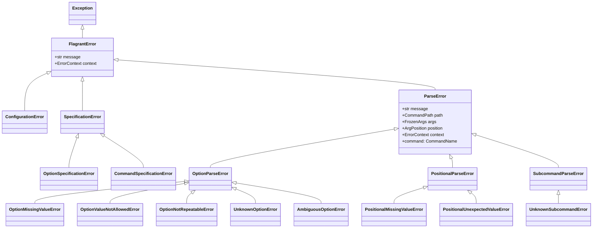

# Error handling in Flagrant

--8<-- "unreleased.md"

Flagrant uses a structured exception hierarchy to communicate parsing failures and specification violations. Errors fall into two categories: specification errors that detect invalid command definitions before parsing begins, and parse errors that represent invalid user input during argument processing.

All errors provide structured context that enables higher-level frameworks to format user-friendly messages, suggest corrections, and provide helpful diagnostics. Flagrant focuses on accurate error detection and rich context; formatting error messages for display is Aclaf's responsibility.

## Table of contents

- [Error hierarchy](#error-hierarchy)
- [Base exceptions](#base-exceptions)
  - [FlagrantError](#flagranterror)
  - [ConfigurationError](#configurationerror)
- [Specification errors](#specification-errors)
  - [SpecificationError](#specificationerror)
  - [OptionSpecificationError](#optionspecificationerror)
  - [CommandSpecificationError](#commandspecificationerror)
- [Parse errors](#parse-errors)
  - [ParseError](#parseerror)
  - [Option parse errors](#option-parse-errors)
  - [Positional parse errors](#positional-parse-errors)
  - [Subcommand parse errors](#subcommand-parse-errors)
- [Error context](#error-context)
- [Examples](#examples)

---

## Error hierarchy

Flagrant's exception hierarchy separates concerns between configuration problems, specification violations, and user input errors. This separation enables targeted error handling at different levels of the application.



**Error categories:**

- **Base exceptions**: `FlagrantError`, `ConfigurationError`
- **Specification errors**: Violations in command specifications detected during construction
- **Parse errors**: User input violations detected during argument parsing
  - **Option parse errors**: Problems with option arguments
  - **Positional parse errors**: Problems with positional arguments
  - **Subcommand parse errors**: Problems with subcommand arguments

## Base exceptions

### FlagrantError

The base exception for all Flagrant-related errors. All exceptions raised by Flagrant extend this class, enabling applications to catch all Flagrant errors with a single handler.

**Signature:**

```python
class FlagrantError(Exception):
    """Base class for all errors raised by the Flagrant library."""

    def __init__(self, message: str, context: ErrorContext | None = None):
        super().__init__(message)
        self.context: ErrorContext = context or {}
```

**Attributes:**

- `message` (str) - Human-readable error description
- `context` (ErrorContext) - Dictionary providing structured information about the error

**ErrorContext type:**

```python
ErrorContextValue = (
    str
    | int
    | float
    | bool
    | None
    | Path
    | list["ErrorContextValue"]
    | dict[str, "ErrorContextValue"]
)
ErrorContext = dict[str, ErrorContextValue]
```

The `context` dictionary can contain any structured information relevant to the error. Specific exception subclasses document which keys they populate.

**Example:**

```python
from flagrant.exceptions import FlagrantError

try:
    # Some Flagrant operation
    pass
except FlagrantError as e:
    # Catches all Flagrant errors
    print(f"Flagrant error: {e}")
    print(f"Context: {e.context}")
```

### Configuration errors

Base exception for configuration-related errors. This includes invalid parser configuration or completion configuration.

**Base class:** `ConfigurationError`

**Extends:** `FlagrantError`

**When raised:** During parser or completer initialization when configuration values violate constraints.

**Example:**

```python
from flagrant.exceptions import ConfigurationError

try:
    # Invalid configuration
    pass
except ConfigurationError as e:
    print(f"Configuration error: {e}")
```

## Specification errors

Specification errors occur when constructing command specifications that violate structural or semantic constraints. These errors prevent invalid specifications from reaching the parser by failing fast during initialization.

### Base specification errors

Base exception for all specification validation errors. Raised when a command specification violates structural constraints.

**Base class:** `SpecificationError`

**Extends:** `FlagrantError`

**When raised:** During `CommandSpecification`, `OptionSpecification`, or related specification object construction.

**Timing:** Before parsing begins (construction-time errors).

**Example:**

```python
from flagrant.specification.exceptions import SpecificationError

try:
    # Create specification
    spec = CommandSpecification(name="cmd")
except SpecificationError as e:
    print(f"Specification error: {e}")
    print(f"Context: {e.context}")
```

### Option specification errors

Raised when an option specification is invalid.

**Base class:** `OptionSpecificationError`

**Extends:** `SpecificationError`

**Signature:**

```python
class OptionSpecificationError(SpecificationError):
    """Raised for an invalid OptionSpecification."""

    def __init__(
        self,
        option_name: OptionName,
        message: str,
        context: ErrorContext | None = None,
    ) -> None:
        full_message = f"Option '{option_name}' is invalid. {message}"
        super().__init__(full_message, context)
```

**When raised:** During option specification construction when the option definition violates constraints.

**Example:**

```python
from flagrant.specification.exceptions import OptionSpecificationError

# This would be raised internally during specification construction
# if an option violates constraints
try:
    # Some operation that validates option specs
    pass
except OptionSpecificationError as e:
    print(f"Invalid option: {e}")
```

### Command specification errors

Raised when a command specification is invalid.

**Base class:** `CommandSpecificationError`

**Extends:** `SpecificationError`

**Signature:**

```python
class CommandSpecificationError(SpecificationError):
    """Raised for an invalid CommandSpecification."""

    def __init__(
        self,
        command_name: CommandName,
        message: str,
        context: ErrorContext | None = None,
    ) -> None:
        full_message = f"Command '{command_name}' is invalid. {message}"
        super().__init__(full_message, context)
```

**When raised:** During command specification construction when the command definition violates constraints.

**Example:**

```python
from flagrant.specification.exceptions import CommandSpecificationError

# This would be raised internally during specification construction
# if a command violates constraints
try:
    # Some operation that validates command specs
    pass
except CommandSpecificationError as e:
    print(f"Invalid command: {e}")
```

## Parse errors

Parse errors occur during argument processing when user input violates specification constraints. Unlike specification errors, these represent user input mistakes rather than configuration problems.

### Base parse errors

Base exception for all parsing errors. Provides common context fields shared by all parse errors.

**Base class:** `ParseError`

**Extends:** `FlagrantError`

**Signature:**

```python
@dataclass(eq=False, slots=True, kw_only=True)
class ParseError(FlagrantError):
    """Base class for errors that occur when parsing command-line arguments.

    Attributes:
        message: A description of the parsing error.
        path: The command path where the error occurred.
        args: The full list of arguments being parsed.
        position: The index in `args` where the error occurred.
        context: Optional context providing additional information about the error.
    """

    message: str = field(default="An unspecified parsing error occurred.")
    path: CommandPath
    args: FrozenArgs
    position: ArgPosition
    context: ErrorContext = field(default_factory=dict, kw_only=True)

    @property
    def command(self) -> CommandName:
        """The command where the error occurred."""
        return self.path[-1]
```

**Common fields (inherited by all parse errors):**

- `message` (str) - Description of the parsing error
- `path` (CommandPath) - Tuple of command names from root to where error occurred
- `args` (FrozenArgs) - Complete tuple of arguments being parsed
- `position` (ArgPosition) - Index in `args` where the error occurred
- `context` (ErrorContext) - Additional structured information
- `command` (property, CommandName) - The command where the error occurred (last element of `path`)

**Example:**

```python
from flagrant.parser.exceptions import ParseError

try:
    result = parse_command_line_args(spec, ["--option", "value"])
except ParseError as e:
    # Catches all parsing errors
    print(f"Parse error: {e.message}")
    print(f"At position: {e.position}")
    print(f"In args: {e.args}")
    print(f"Command path: {e.path}")
    print(f"Command: {e.command}")
```

## Option parse errors

Errors related to option argument parsing. All option parse errors extend `OptionParseError`, which provides the `option` field identifying which option caused the error.

### Base option parse errors

Base exception for option-related parsing errors.

**Base class:** `OptionParseError`

**Extends:** `ParseError`

**Category-specific fields:**

- `option` (OptionName) - Name of the option that caused the error

All option parse errors below inherit fields from both `OptionParseError` and `ParseError`.

### Option missing value errors

Raised when an option did not receive the required number of values.

**Base class:** `OptionMissingValueError`

**Extends:** `OptionParseError`

**Fields:**

- `option` (OptionName) - Option name
- `required` (Arity) - Required arity specification
- `received` (FrozenOptionValues | None) - Values actually received, or None
- Plus all `ParseError` fields: `message`, `path`, `args`, `position`, `context`

**When raised:** During parsing when an option requiring values receives too few arguments.

**Example:**

```python
from flagrant.parser.exceptions import OptionMissingValueError

# Specification requiring 2 values
spec = CommandSpecification(
    name="draw",
    options=(
        ValueOptionSpecification(
            name="rect",
            long_names=frozenset({"rect"}),
            arity=Arity(2, 2)
        ),
    )
)

# User provides only 1 value
try:
    result = parse_command_line_args(spec, ["--rect", "10"])
except OptionMissingValueError as e:
    print(f"Option '{e.option}' requires {e.required.min} values")
    print(f"Received: {e.received}")
    print(f"At position: {e.position}")
    print(f"Args: {e.args}")
```

### Option value not allowed errors

Raised when an option does not accept any values but received one anyway.

**Base class:** `OptionValueNotAllowedError`

**Extends:** `OptionParseError`

**Fields:**

- `option` (OptionName) - Option name
- `received` (OptionValue) - The value that was provided
- Plus all `ParseError` fields: `message`, `path`, `args`, `position`, `context`

**When raised:** When a flag option (arity 0) receives an explicit value using equals syntax (for example, `--flag=value`).

**Example:**

```python
from flagrant.parser.exceptions import OptionValueNotAllowedError

# Flag option
spec = CommandSpecification(
    name="cmd",
    options=(
        FlagOptionSpecification(
            name="verbose",
            long_names=frozenset({"verbose"}),
        ),
    )
)

# User provides value to flag
try:
    result = parse_command_line_args(spec, ["--verbose=true"])
except OptionValueNotAllowedError as e:
    print(f"Flag '{e.option}' does not accept values")
    print(f"Received: {e.received}")
```

### Option not repeatable errors

Raised when an option appears more than once but is not configured to be repeatable.

**Base class:** `OptionNotRepeatableError`

**Extends:** `OptionParseError`

**Fields:**

- `option` (OptionName) - Option name
- `received` (OptionValue) - The value from the repeated occurrence
- Plus all `ParseError` fields: `message`, `path`, `args`, `position`, `context`

**When raised:** When an option configured to reject repetition appears multiple times.

**Example:**

```python
from flagrant.parser.exceptions import OptionNotRepeatableError

# Option configured to reject repetition
spec = CommandSpecification(
    name="cmd",
    options=(
        ValueOptionSpecification(
            name="config",
            long_names=frozenset({"config"}),
            arity=Arity(1, 1),
            # Assume repeatable=False or ERROR accumulation mode
        ),
    )
)

# User specifies option twice
try:
    result = parse_command_line_args(spec, ["--config", "a.conf", "--config", "b.conf"])
except OptionNotRepeatableError as e:
    print(f"Option '{e.option}' cannot be repeated")
    print(f"At position: {e.position}")
```

### Unknown option errors

Raised when an option name is not recognized.

**Base class:** `UnknownOptionError`

**Extends:** `OptionParseError`

**Fields:**

- `option` (OptionName) - Unknown option name
- Plus all `ParseError` fields: `message`, `path`, `args`, `position`, `context`

**When raised:** During parsing when the parser cannot match an option name to any defined option.

**Example:**

```python
from flagrant.parser.exceptions import UnknownOptionError

spec = CommandSpecification(
    name="cmd",
    options=(
        FlagOptionSpecification(name="verbose", long_names=frozenset({"verbose"})),
    )
)

# User specifies unknown option
try:
    result = parse_command_line_args(spec, ["--help"])
except UnknownOptionError as e:
    print(f"Unknown option: {e.option}")
    print(f"Command: {e.command}")
    print(f"Position: {e.position}")
```

### Ambiguous option errors

Raised when an abbreviated option name matches multiple options.

**Base class:** `AmbiguousOptionError`

**Extends:** `OptionParseError`

**Fields:**

- `option` (OptionName) - The ambiguous abbreviation
- `matched` (FrozenOptionNames) - Set of option names that matched
- Plus all `ParseError` fields: `message`, `path`, `args`, `position`, `context`

**When raised:** When the configuration enables option abbreviation matching and a prefix matches multiple options.

**Example:**

```python
from flagrant.parser.exceptions import AmbiguousOptionError

spec = CommandSpecification(
    name="cmd",
    options=(
        FlagOptionSpecification(name="verbose", long_names=frozenset({"verbose"})),
        FlagOptionSpecification(name="verify", long_names=frozenset({"verify"})),
    )
)

# Assume abbreviation enabled
config = ParserConfiguration(allow_abbreviated_options=True)

# User provides ambiguous abbreviation
try:
    result = parse_command_line_args(spec, ["--ver"], config)
except AmbiguousOptionError as e:
    print(f"Ambiguous option: {e.option}")
    print(f"Matches: {e.matched}")
```

## Positional parse errors

Errors related to positional argument parsing. All positional parse errors extend `PositionalParseError`, which provides the `positional` field identifying which positional caused the error.

### Base positional parse errors

Base exception for positional-related parsing errors.

**Base class:** `PositionalParseError`

**Extends:** `ParseError`

**Category-specific fields:**

- `positional` (PositionalName) - Name of the positional that caused the error

All positional parse errors below inherit fields from both `PositionalParseError` and `ParseError`.

### PositionalMissingValueError

Raised when a positional argument did not receive enough values.

**Extends:** `PositionalParseError`

**Fields:**

- `positional` (PositionalName) - Positional name
- `required` (Arity) - Required arity specification
- `received` (FrozenOptionValues | None) - Values actually received, or None
- Plus all `ParseError` fields: `message`, `path`, `args`, `position`, `context`

**When raised:** During parsing when a positional requiring values receives too few arguments.

**Example:**

```python
from flagrant.parser.exceptions import PositionalMissingValueError

# Positional requiring 2 values
spec = CommandSpecification(
    name="copy",
    positionals=(
        PositionalSpecification(name="source", arity=Arity(1, 1)),
        PositionalSpecification(name="dest", arity=Arity(1, 1)),
    )
)

# User provides only 1 positional
try:
    result = parse_command_line_args(spec, ["file1.txt"])
except PositionalMissingValueError as e:
    print(f"Positional '{e.positional}' requires {e.required.min} values")
    print(f"Received: {e.received}")
```

### PositionalUnexpectedValueError

Raised when a positional argument receives unexpected values.

**Extends:** `PositionalParseError`

**Fields:**

- `positional` (PositionalName) - Positional name
- `received` (tuple[str]) - Unexpected values received
- Plus all `ParseError` fields: `message`, `path`, `args`, `position`, `context`

**When raised:** When the parser receives too many positional arguments or encounters positionals where not expected.

**Example:**

```python
from flagrant.parser.exceptions import PositionalUnexpectedValueError

# Specification with limited positionals
spec = CommandSpecification(
    name="cmd",
    positionals=(
        PositionalSpecification(name="file", arity=Arity(1, 1)),
    )
)

# User provides extra positionals
try:
    result = parse_command_line_args(spec, ["file1.txt", "file2.txt", "file3.txt"])
except PositionalUnexpectedValueError as e:
    print(f"Unexpected values for '{e.positional}': {e.received}")
```

## Subcommand parse errors

Errors related to subcommand parsing. All subcommand parse errors extend `SubcommandParseError`, which provides the `subcommand` field identifying which subcommand caused the error.

### Base subcommand parse errors

Base exception for subcommand-related parsing errors.

**Base class:** `SubcommandParseError`

**Extends:** `ParseError`

**Category-specific fields:**

- `subcommand` (str) - Subcommand name

All subcommand parse errors below inherit fields from both `SubcommandParseError` and `ParseError`.

### UnknownSubcommandError

Raised when a subcommand name is not recognized.

**Extends:** `SubcommandParseError`

**Fields:**

- `subcommand` (str) - Unknown subcommand name
- Plus all `ParseError` fields: `message`, `path`, `args`, `position`, `context`

**When raised:** During parsing when the parser cannot match a subcommand name to any defined subcommand.

**Example:**

```python
from flagrant.parser.exceptions import UnknownSubcommandError

spec = CommandSpecification(
    name="git",
    subcommands=(
        CommandSpecification(name="commit"),
        CommandSpecification(name="push"),
    )
)

# User specifies unknown subcommand
try:
    result = parse_command_line_args(spec, ["branch"])
except UnknownSubcommandError as e:
    print(f"Unknown subcommand: {e.subcommand}")
    print(f"Parent command: {e.path[-2] if len(e.path) > 1 else None}")
```

## Error context

All errors inherit from `FlagrantError`, which provides a `context` dictionary for structured information. Parse errors extend this with standard fields for parsing context.

### Standard parse error fields

All `ParseError` subclasses provide these fields:

| Field | Type | Description |
|:------|:-----|:------------|
| `message` | `str` | Description of the parsing error |
| `path` | `CommandPath` | Tuple of command names from root to error location |
| `args` | `FrozenArgs` | Complete tuple of arguments the parser processes |
| `position` | `ArgPosition` | Index in `args` where the error occurred |
| `context` | `ErrorContext` | Structured information dictionary |
| `command` | `CommandName` (property) | The command where error occurred (last in `path`) |

### Category-specific fields

**Option parse errors** (`OptionParseError` subclasses) add:

- `option` (OptionName) - Name of the option

**Positional parse errors** (`PositionalParseError` subclasses) add:

- `positional` (PositionalName) - Name of the positional

**Subcommand parse errors** (`SubcommandParseError` subclasses) add:

- `subcommand` (str) - Subcommand name

### Error-specific fields

Individual error classes add fields specific to their failure mode:

**OptionMissingValueError:**

- `required` (Arity) - Required arity
- `received` (FrozenOptionValues | None) - Values received

**OptionValueNotAllowedError:**

- `received` (OptionValue) - Value provided

**OptionNotRepeatableError:**

- `received` (OptionValue) - Value from repeated occurrence

**AmbiguousOptionError:**

- `matched` (FrozenOptionNames) - Set of matching option names

**PositionalMissingValueError:**

- `required` (Arity) - Required arity
- `received` (FrozenOptionValues | None) - Values received

**PositionalUnexpectedValueError:**

- `received` (tuple[str]) - Unexpected values

## Examples

### Catching all Flagrant errors

```python
from flagrant.exceptions import FlagrantError

try:
    result = parse_command_line_args(spec, args)
except FlagrantError as e:
    # Catches all Flagrant errors: specification, configuration, and parse errors
    print(f"Error: {e}")
    if e.context:
        print(f"Context: {e.context}")
```

### Catching specification errors during development

```python
from flagrant.specification.exceptions import (
    SpecificationError,
    OptionSpecificationError,
    CommandSpecificationError,
)

try:
    spec = CommandSpecification(
        name="cli",
        options=(
            ValueOptionSpecification(name="output", long_names=frozenset({"output"})),
        )
    )
except OptionSpecificationError as e:
    print(f"Invalid option specification: {e}")
except CommandSpecificationError as e:
    print(f"Invalid command specification: {e}")
except SpecificationError as e:
    print(f"Specification error: {e}")
```

### Handling parse errors for user feedback

```python
from flagrant.parser.exceptions import (
    ParseError,
    UnknownOptionError,
    AmbiguousOptionError,
    OptionMissingValueError,
)

try:
    result = parse_command_line_args(spec, args)
except UnknownOptionError as e:
    print(f"Unknown option '{e.option}' at position {e.position}")
    print(f"Command: {e.command}")
except AmbiguousOptionError as e:
    print(f"Ambiguous option '{e.option}' matches: {', '.join(e.matched)}")
except OptionMissingValueError as e:
    print(f"Option '{e.option}' requires {e.required.min} values")
    print(f"Received: {e.received or 'none'}")
except ParseError as e:
    print(f"Parse error: {e.message}")
    print(f"At position {e.position} in: {e.args}")
```

### Accessing error context

```python
from flagrant.parser.exceptions import OptionMissingValueError

try:
    result = parse_command_line_args(spec, ["--coords", "10"])
except OptionMissingValueError as e:
    # Access standard ParseError fields
    print(f"Message: {e.message}")
    print(f"Command path: {e.path}")
    print(f"Command: {e.command}")  # Property - last element of path
    print(f"Arguments: {e.args}")
    print(f"Position: {e.position}")

    # Access OptionParseError field
    print(f"Option: {e.option}")

    # Access OptionMissingValueError-specific fields
    print(f"Required arity: min={e.required.min}, max={e.required.max}")
    print(f"Received: {e.received}")

    # Access optional context dictionary
    if e.context:
        print(f"Additional context: {e.context}")
```

### Handling multiple error types

```python
from flagrant.parser.exceptions import (
    OptionParseError,
    PositionalParseError,
    SubcommandParseError,
)

try:
    result = parse_command_line_args(spec, args)
except OptionParseError as e:
    # All option-related errors
    print(f"Option error with '{e.option}': {e.message}")
except PositionalParseError as e:
    # All positional-related errors
    print(f"Positional error with '{e.positional}': {e.message}")
except SubcommandParseError as e:
    # All subcommand-related errors
    print(f"Subcommand error with '{e.subcommand}': {e.message}")
```

### Using error information for suggestions

```python
from flagrant.parser.exceptions import UnknownOptionError

try:
    result = parse_command_line_args(spec, ["--hlep"])
except UnknownOptionError as e:
    # Use error context to provide suggestions
    # (Aclaf would implement fuzzy matching on valid options)
    print(f"Unknown option: {e.option}")
    print(f"Did you mean one of these?")
    # Valid options would be extracted from spec, not error
    # Error provides structured context for Aclaf's suggestion engine
```

---

## See also

- **[Parser behavior](behavior.md)**: Parsing algorithms and error conditions
- **[Concepts](concepts.md)**: Core concepts and terminology
- **[Configuration](configuration.md)**: Parser configuration options
- **[Grammar](grammar.md)**: Syntax specification and validation rules
