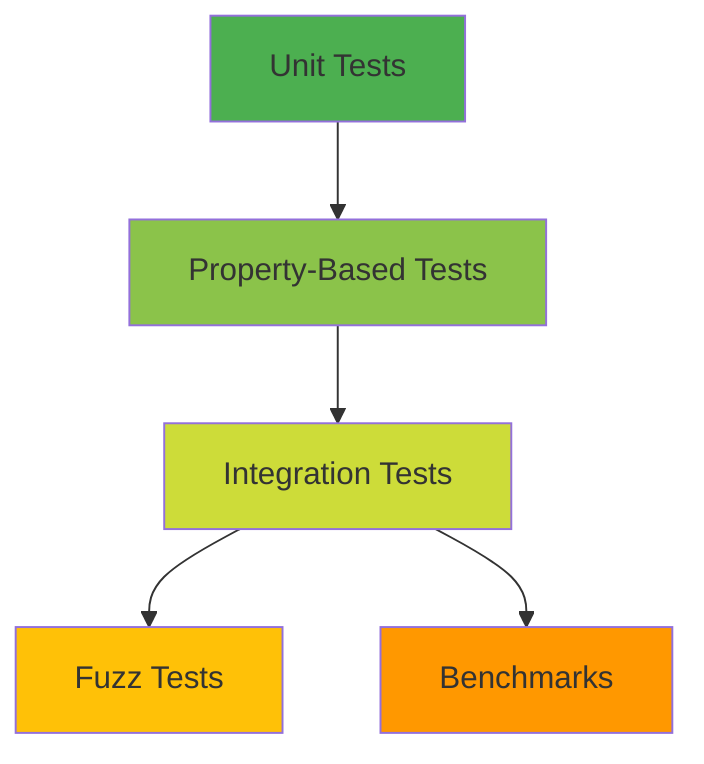

# Testing strategy

--8<-- "unreleased.md"

This document explains Flagrant's testing philosophy and approach at a conceptual level. Flagrant employs a comprehensive, multi-layered testing strategy to ensure correctness, robustness, and performance of its parsing capabilities. The strategy balances different testing approaches—unit tests for component isolation, integration tests for end-to-end scenarios, property-based tests for discovering edge cases, fuzz tests for robustness, and benchmarks for performance validation.

The testing implementation provides detailed specifications, test patterns, and operational guidance.

## Table of contents

- [Testing strategy](#testing-strategy)
  - [Table of contents](#table-of-contents)
  - [Testing scope](#testing-scope)
  - [Testing philosophy](#testing-philosophy)
  - [The test pyramid](#the-test-pyramid)
  - [Coverage philosophy](#coverage-philosophy)
  - [Testing tools](#testing-tools)
  - [Security testing integration](#security-testing-integration)
  - [When to use each testing approach](#when-to-use-each-testing-approach)
  - [See also](#see-also)

---

## Testing scope

Flagrant is a **parser** for command-line interfaces. Its testing strategy focuses on syntactic analysis—transforming raw argument strings into structured data. This is fundamentally different from testing a complete CLI framework.

**Flagrant tests:**

- Argument tokenization and classification (identifying options, positionals, subcommands)
- Option and positional value extraction according to arity constraints
- Subcommand hierarchy parsing and delegation
- Parse result structure correctness and immutability

**Flagrant does NOT test** (these are Aclaf's responsibilities):

- Type conversion (strings to integers, paths, enums, dates, etc.)
- Validation (business rules, constraints, parameter relationships)
- Command execution and routing
- Application lifecycle management
- Terminal output and formatting
- User interface concerns (help text generation, error display)

This separation ensures Flagrant remains a focused, reusable parsing engine that Aclaf and other frameworks can build upon. The testing strategy reflects this architectural boundary—tests verify that arguments are correctly parsed into structured data without concern for what applications do with that data.

## Testing philosophy

Flagrant's testing strategy rests on foundational principles that guide test design and quality standards:

**Specification-driven testing**: tests verify that implementation matches formal specifications documented in [Grammar](grammar.md) and [Behavior](behavior.md). When a test documents expected behavior, the specification documents *why* that behavior meets requirements. Tests serve as executable specifications that validate implementation correctness against defined contracts.

**Deterministic and repeatable**: all parsing operations are deterministic given identical inputs and configuration. Tests are deterministic and repeatable without relying on mutable state or randomness. Property-based tests use seeded randomness to enable replay of failures, ensuring that discovered edge cases can be consistently reproduced.

**Isolation and composability**: unit tests isolate individual components to verify behavior in controlled conditions. Integration tests exercise complete parsing scenarios with multiple components working together. Property-based tests verify that components compose correctly across thousands of generated inputs. Fuzz tests explore unexpected input combinations that might not occur in normal usage. This layered approach ensures components work both independently and together.

**Measurable coverage**: test coverage measurement and tracking enforce a mandatory >95% threshold for all new code. Coverage includes branch coverage to ensure all conditional paths get exercised. Critical paths identified in parser design receive 100% coverage through both example-based and property-based tests. Coverage serves as a minimum bar, not a goal—high coverage without meaningful assertions proves nothing.

**Performance validation**: benchmarking validates that the parser meets its O(n) performance constraint and sub-millisecond typical-case target. Performance tests are not afterthoughts—they're integral to the testing strategy because performance characteristics are part of the parser's contract. Benchmark comparisons detect performance regressions before they reach production.

**Security-conscious**: tests validate that the parser enforces security boundaries including arity bounds, safe name resolution, resource consumption limits, and robust error handling. Security testing focuses on parser-specific attack vectors like resource exhaustion through algorithmic complexity, crash resistance with malformed input, and prevention of regular expression ReDoS attacks. Command injection and path traversal are out of scope since Flagrant only parses arguments without executing commands or accessing files.

## The test pyramid

Flagrant's testing strategy follows a test pyramid model, balancing different testing levels to achieve comprehensive coverage without redundancy or excessive maintenance burden. The pyramid shape reflects both the quantity and scope of tests at each level.

### Unit tests

Unit tests exercise individual parser components and functions in isolation, verifying behavior with controlled inputs and minimal dependencies.

Unit tests answer the question: "Does this specific component work correctly in isolation?" They test functions like argument classification (is `--verbose` recognized as a long option?), value consumption (does an option with arity 2-4 consume the correct number of values?), and name resolution (does case-insensitive matching work?). Each test focuses on one behavior with concrete input-output pairs demonstrating expected results.

Unit tests run quickly (microseconds each), failures pinpoint exact locations, and they're easy to write and maintain. When a unit test fails, developers immediately know which component broke and why. This fast feedback loop is essential during active development.

Unit tests use example-based testing with explicit assertions. Test names follow the pattern `test_<scenario>_<expected_result>` to make intent clear without requiring docstrings. Domain-based organization (option parsing, positional grouping, subcommand resolution) rather than task-based organization ensures cohesion as the codebase evolves.

### Property-based tests

Property-based tests use Hypothesis to generate thousands of valid and edge-case inputs, verifying that parser-defined invariants hold across all cases. Rather than testing specific examples, property-based tests verify general properties that must always be true.

Property-based testing answers the question: "Does this behavior hold for ALL valid inputs, not just the examples considered?" For instance, rather than testing that parsing `["--verbose"]` produces the same result twice, property-based tests verify that parsing *any* valid command line with *any* specification produces identical results on repeated invocations. This is the "parse determinism" invariant.

Property-based testing discovers edge cases developers didn't expect. Hypothesis generates inputs systematically, exploring boundary conditions, unusual combinations, and pathological cases. When a property test fails, Hypothesis shrinks the failing input to a minimal reproduction case, making debugging tractable.

Key invariants tested include parse determinism (identical inputs produce identical results), arity enforcement (consumed values meet min/max constraints), accumulation correctness (each mode produces expected value structures), name resolution consistency (matching inputs resolve to same options), and positional grouping correctness (the algorithm distributes values according to arity constraints while reserving for later specs).

Property-based tests complement unit tests—unit tests verify specific behaviors work, while property tests verify those behaviors hold universally. This combination provides high confidence in correctness across the entire input space, not just tested examples.

### Integration tests

Integration tests exercise the parser with complete command specifications and argument sequences. Rather than testing components in isolation, integration tests verify that components work together correctly in scenarios resembling actual CLI applications.

Integration tests answer the question: "Do all the pieces work together correctly in realistic usage?" They test complete parsing flows like a build command with output directory option and multiple source file arguments, or a Git-style command with nested subcommands (`git remote add origin https://example.com`).

Integration tests validate that argument classification, value consumption, accumulation, name resolution, and positional grouping compose correctly without unexpected interactions. They catch integration bugs that unit tests miss, such as option parsing affecting positional grouping in unintended ways, or subcommand resolution interfering with parent option processing.

Integration tests are slower than unit tests, failures require more investigation to isolate root causes, and they're more sensitive to changes across the codebase. Integration tests should focus on realistic scenarios rather than exhaustively combining all features. Property-based tests verify composition across wide input ranges—integration tests verify that realistic compositions work correctly.

### Fuzz tests

Fuzz tests use Atheris to generate random, potentially malformed inputs exploring parser behavior under unexpected or adversarial conditions. Fuzz tests don't verify correct behavior—they verify the parser never crashes, hangs, or violates security boundaries regardless of input.

Fuzz testing answers the question: "Can anything break the parser?" Tests generate malformed arguments, unusual character combinations, long strings, special characters, Unicode edge cases, and invalid option combinations. The goal is finding crashes, hangs, excessive resource consumption, or security violations that structured testing misses.

Fuzz tests have different success criteria than other tests. A fuzz test passes if the parser either produces a valid parse result or raises a structured `FlagrantException` with appropriate error details. Generic exceptions, crashes, hangs, or unbounded memory consumption signify bugs. Fuzz tests validate defensive programming and error handling paths that might never get exercised with example-based inputs.

Fuzz tests maintain a corpus of interesting inputs (discovered boundary conditions, inputs that caused crashes in the past, security-relevant patterns) that get replayed on each run to prevent regressions.

### Benchmarks

Benchmarks measure parser performance, validating that it meets O(n) linear time complexity and sub-millisecond typical-case performance targets. Performance tests verify that algorithmic complexity matches design constraints and that performance doesn't degrade over time.

Benchmarking answers the question: "Does the parser meet its performance contract?" Tests measure parsing time for argument counts, specification complexities, and configuration combinations. Benchmarks verify linear scaling (doubling arguments approximately doubles time), fast typical cases (parsing 50 arguments in <1 ms), and reasonable complex cases (parsing 50 arguments with 20 options across 3 command levels in <2 ms).

Benchmarks use pytest-benchmark for measurement and comparison. Each benchmark run saves baseline results, and later runs compare against the baseline to detect regressions. Strict comparison mode fails if performance degrades by >10% from baseline, preventing performance regressions from merging.

Benchmarks test performance characteristics, not functional behavior. Benchmarks complement functional tests rather than duplicating them. A benchmark that doesn't verify correctness of results isn't useful—benchmarks should assert that parsing succeeded and produced valid results while measuring time.

## Coverage philosophy

Flagrant maintains mandatory >95% code coverage for all new code in `src/flagrant/`. This threshold includes both line coverage (every executable line executed) and branch coverage (every conditional branch exercised). Pytest-cov measures coverage and CI validates it on all pull requests.

The >95% threshold is a minimum bar, not a goal. High coverage without meaningful assertions proves nothing—tests must verify behavior, not just execute code. Coverage serves as a safety net to identify untested code paths, but coverage percentage alone doesn't signify test quality.

Critical paths receive 100% coverage through multiple testing approaches. Both example-based tests (verifying specific behaviors) and property-based tests (verifying invariants) must exercise core parsing loops, value consumption algorithms, positional grouping, and name resolution logic. This redundancy isn't wasteful—different test types discover different bugs.

**Critical paths requiring 100% coverage:**

- Core parsing loop (argument classification and dispatching)
- Option value consumption (arity enforcement, boundary detection)
- Positional grouping algorithm (distribution, minimum reservation)
- Accumulation mode handling (value combination logic)
- Name resolution (exact matching, case-insensitive, abbreviation, normalization)
- Specification validation (detecting invalid configurations)

Coverage excludes `pass` statements, ellipsis in stub implementations, unreachable code verified by the type checker, and external library code. These exclusions prevent artificially inflated coverage numbers that don't reflect actual test completeness.

Coverage tracking uses HTML reports for detailed analysis, showing exactly which lines and branches remain untested. Developers review coverage reports before marking pull requests ready for review, adding tests to cover any gaps below the 95% threshold.

## Testing tools

Flagrant's testing infrastructure uses carefully selected tools that integrate well with modern Python development practices:

**pytest**: primary test framework providing test discovery, fixtures, parametrization, and plugin architecture. Pytest's simple assertion style and clear failure messages make tests readable and debugging straightforward. All tests use pytest conventions and markers for selective execution.

**pytest-cov**: coverage measurement using Coverage.py with pytest integration. Generates HTML and terminal reports showing line and branch coverage. Integrates with CI to enforce coverage thresholds.

**Hypothesis**: property-based testing framework generating test cases from high-level specifications. Provides strategies for composing complex test inputs and shrinking failing cases to minimal reproductions. Integrates seamlessly with pytest.

**Atheris**: fuzzing framework based on libFuzzer, enabling coverage-guided fuzzing of Python code. Generates random inputs and uses coverage feedback to guide exploration toward interesting code paths. Maintains corpus of discovered edge cases.

**pytest-benchmark**: performance testing framework providing accurate timing measurements, statistical analysis, and baseline comparison. Integrates with pytest for consistent test execution and reporting.

**pytest-mock**: mocking framework wrapping the standard library unittest.mock with pytest integration. Used sparingly since Flagrant has minimal dependencies and few external interactions requiring mocks.

These tools are development dependencies only—Flagrant's runtime dependency is `typing-extensions` alone. The testing tools get defined in `pyproject.toml` under `[project.optional-dependencies.dev]` and installed via `uv sync`.

## Security testing integration

Security testing integrates throughout the testing pyramid rather than being a separate category. Each testing level addresses different security concerns relevant to a command-line parser.

**Unit tests** verify security boundaries like arity enforcement (preventing consumers from assuming fixed-size arrays), name resolution correctness (preventing option confusion attacks), and specification validation (rejecting configurations that could lead to ambiguity or crashes).

**Property-based tests** verify security-relevant invariants like resource consumption (parsing large argument arrays completes in bounded time with linear memory usage), regular expression ReDoS protection (rejecting custom negative number patterns with nested quantifiers), and Unicode handling safety (parsing unicode arguments without encoding errors or crashes).

**Fuzz tests** explicitly target security by generating adversarial inputs attempting to trigger crashes, hangs, excessive memory consumption, or boundary violations. Fuzz test success criteria include "no crashes on any input" and "resource usage remains bounded."

**Integration tests** verify that security properties compose correctly across components. For instance, testing that strict POSIX mode doesn't create new ambiguity vectors, or that argument file expansion doesn't bypass arity enforcement.

Flagrant's security testing focuses on **parser-specific attack vectors**:

- **Resource exhaustion**: DoS through algorithmic complexity (ReDoS, quadratic parsing algorithms)
- **Crash resistance**: Robust handling of malformed input without panics or undefined behavior
- **Arity bound enforcement**: Preventing buffer overruns in downstream consumers assuming fixed value counts
- **Input validation**: Rejecting invalid specifications that could lead to ambiguity or crashes

Flagrant does NOT test command injection, path traversal, or privilege escalation—these are **Aclaf's responsibilities** since Flagrant only parses arguments into structured data without executing commands, accessing files, or managing privileges. This architectural boundary is crucial for understanding security test scope.

## When to use each testing approach

Choosing the right testing approach depends on what you're testing and what properties matter most. This decision framework guides test selection:

**Choose unit tests when:**

- Testing individual functions or methods in isolation
- Verifying specific behaviors with concrete input-output pairs
- Debugging requires pinpointing exact failure location
- Fast feedback loop is important during development
- Examples show expected behavior

**Choose property-based tests when:**

- Testing invariants that must hold for all valid inputs
- Discovering edge cases you didn't expect
- Verifying composition of multiple components
- Testing pure functions with well-defined properties
- Coverage across entire input space is important

**Choose integration tests when:**

- Testing end-to-end scenarios resembling actual usage
- Verifying components work together correctly
- Testing realistic command specifications
- Catching integration bugs that unit tests miss
- Validating complete parsing flows

**Choose fuzz tests when:**

- Testing robustness under malformed input
- Finding crashes, hangs, or security vulnerabilities
- Verifying defensive programming and error handling
- Exploring input space systematically
- Testing parser behavior with adversarial inputs

**Choose benchmarks when:**

- Verifying algorithmic complexity (O(n) scaling)
- Detecting performance regressions
- Validating performance targets (sub-millisecond parsing)
- Measuring performance across different configurations
- Ensuring performance characteristics match design constraints

In practice, critical features receive multiple test types. For instance, value consumption might have unit tests verifying specific arity cases, property tests verifying arity enforcement universally, integration tests showing it works in realistic commands, and fuzz tests ensuring malformed inputs don't crash the consumption logic. This redundancy provides defense in depth—different test types discover different bugs.

---

## See also

- **[Architecture](architecture.md)**: System architecture and design principles
- **[Grammar](grammar.md)**: Formal syntax and argument classification rules
- **[Behavior](behavior.md)**: Parsing algorithms and semantics
- **[Configuration](configuration.md)**: Parser configuration options affecting behavior
